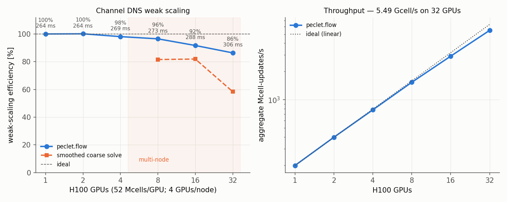
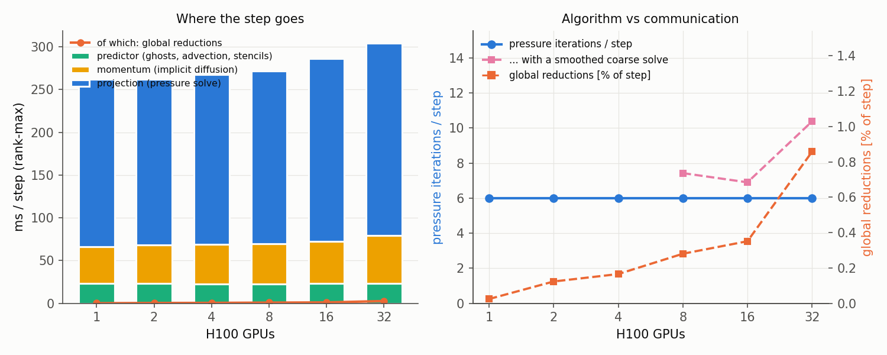

This is the performance companion to the [wall-bounded turbulence example](../../examples/wall-bounded-turbulence/index.qmd),
which is about *reproducing* the Moser–Kim–Mansour channel-flow statistics. The question here is what
that DNS costs across many GPUs, and what sets the limit.

The instrument, the machine and the methodology are shared with the
[parallel-scaling study](../parallel-scaling/index.qmd) — same per-phase timers, same Snellius
`gpu_h100` partition, one MPI rank cgroup-bound to each GPU with GPU-aware MPI. What changes is the
physics: walls instead of periodicity everywhere.

## How you scale a channel

A periodic benchmark scales by **tiling**: add GPUs, add copies of the same vortex, every rank keeps
solving an identical problem. A channel has walls in the wall-normal direction, so it can only grow in
the two periodic directions — but that is legitimate, and worth being precise about why.

The DNS is streamwise-periodic with a body force, so there is no inflow, no outflow and **no
streamwise development**: the flow is statistically homogeneous in `x` by construction. What the box
length must satisfy is decorrelation — long enough that a structure does not interact with its own
periodic image. Past a few correlation lengths the single-point statistics stop depending on the box,
and extra length simply adds independent realisations. So replicating the box is the channel analogue
of tiling vortices: **rung N is the same turbulence, with more copies of it.**

This ladder replicates one 1024 × 160 × 320 box (Lx = 12.8H, Lz = 4.0H, Δ⁺ = 2.25 — the MKM box at
this resolution) alternately in the two periodic directions:

| GPUs | tiles | grid | Mcells | Mcells/GPU |
|---|---|---|---|---|
| 1 | 1×1 | 1024×160×320 | 52.4 | 52.4 |
| 2 | 2×1 | 2048×160×320 | 104.9 | 52.4 |
| 4 | 2×2 | 2048×160×640 | 209.7 | 52.4 |
| 8 | 4×2 | 4096×160×640 | 419.4 | 52.4 |
| 16 | 4×4 | 4096×160×1280 | 838.9 | 52.4 |
| 32 | 8×4 | 8192×160×1280 | 1677.7 | 52.4 |

**Exactly 52.4 M cells per GPU at every rung**, identical Δ⁺ and dt, unchanged CPG driving force, and
every dimension rich in factors of two — which matters more than it sounds, see
[below](#grid-dimensions-are-the-single-biggest-lever). Load imbalance is 1.000 at every rung.

## The curve



| GPUs | ms/step | pressure iters/step | Mcell/s | weak efficiency |
|---|---|---|---|---|
| 1 | 263.9 | 6.00 | 199 | 100 % |
| 2 | 263.6 | 6.00 | 398 | 100 % |
| 4 | 269.0 | 6.00 | 780 | 98 % |
| 8 | 273.5 | 6.00 | 1534 | 96 % |
| 16 | 287.8 | 6.00 | 2915 | 92 % |
| 32 | 305.6 | 6.00 | 5490 | **86 %** |

**5.5 Gcell-updates/s on 32 H100s at 86 % weak efficiency, with the pressure solve pinned at exactly
6.00 iterations per step from one GPU to thirty-two.** A 1.68-billion-cell channel advances in 306 ms
per step against 264 ms for a 52 M-cell one on a single GPU.

## Where the step goes



Communication is not the limit: the pressure solve's global reductions run from 0.06 ms at 1 GPU to
2.6 ms at 32 — **0.02 % to 0.86 % of the step** — and the reduction *count* is constant at 33 per step
rather than growing. Load imbalance is 1.000 throughout.

The 14 % that is lost by 32 GPUs is entirely per-iteration cost, not more iterations:

| | 1 GPU | 32 GPUs |
|---|---|---|
| predictor | 23.1 ms | 23.4 ms |
| momentum | 43.0 ms | 55.7 ms |
| projection | 196.3 ms | 224.9 ms |
| — per pressure iteration | 32.7 ms | 37.5 ms |
| global reductions | 0.06 ms | 2.62 ms |

The predictor is flat. The projection does the same 6 iterations at every rung and each costs 15 %
more, which is halo exchange inside the smoother and matvec. The momentum solve picks up one extra
sweep at 32 GPUs (9 → 10) on top of a 17 % per-sweep increase. That is the healthy kind of
weak-scaling loss — surface-to-volume, not algorithm.

## What makes it work: the coarse-level solve

A V-cycle converges at a rate independent of the domain only if its **coarsest level is effectively
solved**, and a distributed geometric hierarchy cannot always get there. An axis stops coarsening once
it turns odd, and under MPI once *any rank's block* turns odd — so the floor is roughly one cell per
rank. At fixed cells/GPU the per-rank block is constant, so the coarsest **global** grid grows with the
rank count no matter how many levels you request. Asking for more depth is a no-op past that point;
the fix is to agglomerate the coarsest level onto a global operator and solve it there.

Running the identical ladder both ways isolates it:

| GPUs | agglomerated bottom | smoothed bottom | |
|---|---|---|---|
| 8 | 273.5 ms, 6.00 iters | 323.5 ms, 7.42 iters | 1.18× |
| 16 | 287.8 ms, 6.00 iters | 322.2 ms, 6.90 iters | 1.12× |
| 32 | 305.6 ms, **6.00** iters | 452.0 ms, **10.38** iters | **1.48×** |

Without it the iteration count climbs with the rank count and weak efficiency falls to 58 % at 32
GPUs; with it, iterations do not move at all. The same effect is visible on a single GPU with no MPI
in sight — lengthening a 2048 × 64 × 64 channel and varying only the depth:

| levels | smoothed bottom | agglomerated bottom |
|---|---|---|
| 4 | 13.5 iters, 167 ms | **4.0 iters, 112 ms** |
| 6 | 6.0 iters, 91 ms | **4.0 iters, 69.5 ms** |
| 12 (full geometric depth) | 4.4 iters, 77.2 ms | 4.4 iters, 77.1 ms |

An exact coarse solve is depth-independent, and a *shallow* hierarchy over it beats a deep one —
the extra levels cost more than the coarse solve they replace. The criterion is the coarsest grid's
largest **extent**, not its cell count: a 64 × 2 × 2 bottom is only 256 cells and still costs 6.0
iterations against 4.0, because a point smoother needs O(L²) sweeps to damp a wavelength of L cells.

Select it with `set_pressure_bottom("auto")`, which agglomerates exactly when the coarsest grid
exceeds four cells on any axis. The gathered operator is keyed by global cell id, so it is
decomposition-independent by construction — measured, a 6-rank run agrees with a single-rank one to
4.5 × 10⁻¹⁶.

## Grid dimensions are the single biggest lever

The multigrid coarsens each axis independently and only while that axis is **even**, so a dimension's
usable depth is its number of factors of two — and an odd dimension never coarsens at all. Measured on
one GPU, 384 × 128 × N, everything else held:

| spanwise cells | halvings | pressure iters/step | ms/step |
|---|---|---|---|
| 256 | 8 | **5.0** | 120 |
| 250 | 1 | 9.8 | 195 |
| 255 | **0** | **16.2** | **329** |

One odd number costs 3.2×, with no MPI involved. A channel box derived the natural way —
`nx = round(2π·ny)`, `nz = round(2π/3·ny)` — lands on 1508 × 240 × 503, where the streamwise axis
halves twice, the wall-normal four times, and the spanwise never. **Round the grid to numbers rich in
factors of two before anything else.** `flow` ships a checker that needs neither a GPU nor a job:

```bash
python scripts/check_decomposition.py --grid 1508,240,503 --levels 5 --np 4 --walls --verbose
```

## Refining instead of replicating

Replicating answers "how efficiently does the machine run this solver". The other question a DNS user
asks is "can more GPUs buy me a *finer* DNS in the same wall-clock", which is a different ladder:
hold the box and refine it, so Δ⁺ goes 2.25 → 0.70 across 1–32 GPUs at ~46 M cells/GPU.

| GPUs | 1 | 2 | 4 | 8 | 16 | 32 |
|---|---|---|---|---|---|---|
| ms/step | 237 | 221 | 322 | 410 | 482 | 700 |
| pressure iters/step | 6.0 | 6.0 | 7.6 | 9.2 | 12.9 | 18.6 |
| weak efficiency | 100 % | 93 % | 75 % | 58 % | 43 % | 32 % |

That curve decays, and the decay is again the iteration count — but here, unlike the replicated
ladder, **the coarse solve is not what causes it.** Re-running the identical ladder with the
agglomerated bottom changes essentially nothing:

| GPUs | 1 | 2 | 4 | 8 | 16 |
|---|---|---|---|---|---|
| iters, smoothed bottom | 6.00 | 6.00 | 7.60 | 9.20 | 12.85 |
| iters, agglomerated bottom | 6.00 | 6.00 | 7.60 | 9.22 | **12.85** |
| ms/step, agglomerated | 237 | 218 | 318 | 417 | 462 |

It is not a no-op that failed to engage: the coarsest grid on these rungs runs 15 to 72 cells across,
well past the threshold, and forcing agglomeration explicitly gives the same 12.85. The bottom simply
is not the limit here.

Three things are therefore ruled out. **Communication** — 0.03 to 0.77 % of the step. **The
decomposition** — one *fixed* grid on 1/2/4/8 GPUs holds iterations at 24.7 / 25.8 / 24.2 / 23.9,
flat. **The coarse level** — the table above. What remains is the refinement itself, and that
reproduces with no MPI in sight: on a single GPU, refining the same 6:1:2 box from Δ⁺ = 11.25 to 3.75
takes the solve from 4.0 to 5.0 iterations, the same trend the ladder continues to 12.85 at Δ⁺ = 0.94.

So refining this wall-bounded problem genuinely costs more iterations, and the GPU count is
incidental. Two candidates remain unseparated: the V-cycle not being perfectly resolution-independent
on a walled domain, and the flow itself changing as it becomes better resolved — a Δ⁺ = 2.25 field and
a Δ⁺ = 0.70 field are not the same turbulence, and the pressure solve sees whatever divergence the
velocity field hands it. Distinguishing them needs a fixed, converged flow field re-solved at several
resolutions, which is not this measurement.

The honest summary is that **the replicated ladder measures the machine and the refinement ladder
measures the method**, and only the first is a parallel-efficiency number.

## Strong scaling: the same DNS, faster

Fixed 46.4 M-cell box, more GPUs:

| GPUs | 1 | 2 | 4 | 8 |
|---|---|---|---|---|
| ms/step | 830 | 486 | 301 | 227 |
| speed-up | 1.00× | 1.71× | 2.75× | 3.66× |
| efficiency | 100 % | 85 % | 69 % | 46 % |
| Mcells/GPU | 46.4 | 23.2 | 11.6 | 5.8 |

3.7× on 8 GPUs with the per-GPU problem down to 5.8 M cells; the falloff is the local work shrinking
toward fixed per-step overheads, not the pressure solve — iterations are flat across this sweep.

## Reproducing

The run pack is [`benchmarks/channel-scaling/snellius/`](https://github.com/computational-chemical-engineering/peclet-examples/tree/main/benchmarks/channel-scaling/snellius)
— one job per rung, resumable, mode and result tag as positional arguments:

```bash
sbatch --nodes=8 chan_weak_gpu.sh tile        # the replicated ladder (+ smoothed-bottom companions)
sbatch --nodes=4 chan_weak_gpu.sh refine      # the refinement ladder
sbatch --nodes=2 chan_weak_gpu.sh strong      # fixed-box strong scaling
```

Every run writes a JSON with the per-phase timers, iteration counts, reduction time and count and the
full block map; all of them are in [`results/snellius-h100/`](https://github.com/computational-chemical-engineering/peclet-examples/tree/main/benchmarks/channel-scaling/results/snellius-h100),
and `plot_scaling.py` regenerates the figures from them. The driver is the production DNS driver
[`channel_dns_mpi.py`](../../examples/wall-bounded-turbulence/channel_dns_mpi.py) — the benchmark runs
the same code path as a real run, not a stripped-down kernel.
