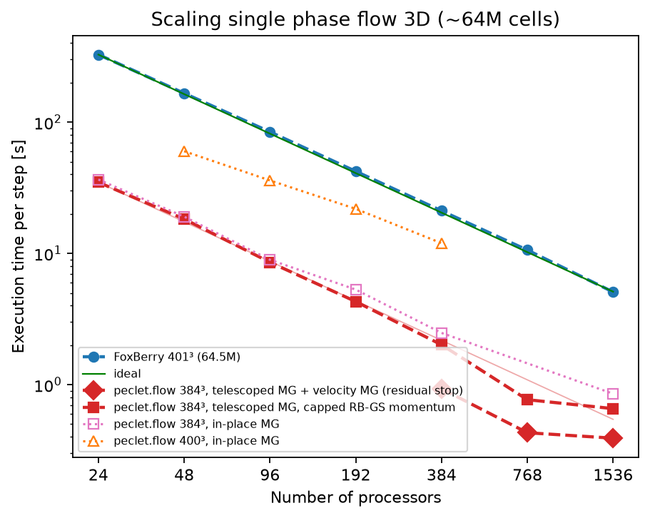
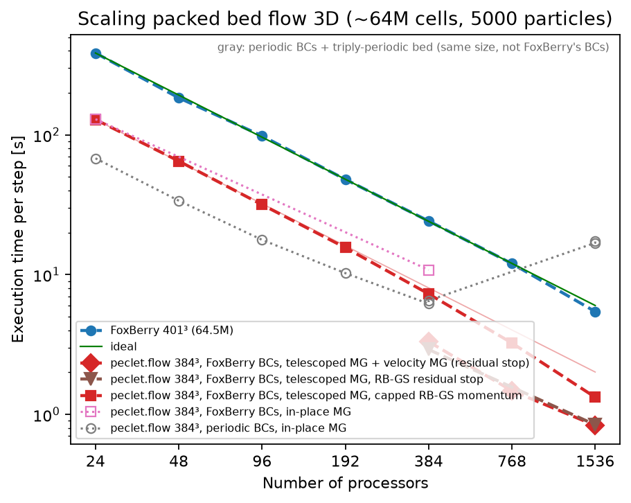
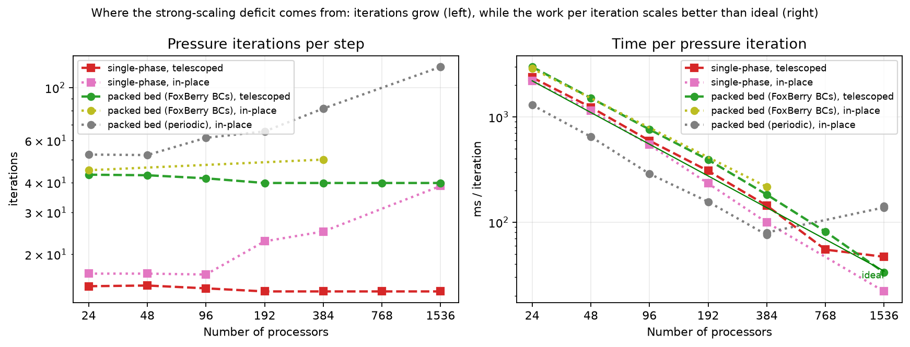

::: {.callout-note title="Status (2026-09-02)"}
Second campaign, complete ladder. Since the first (2026-09-01) the pressure multigrid gained
**coarse-level telescoping on the ORB tree** — the coarse-grid limit that capped the first ladder
is gone — the packed bed runs with **FoxBerry's own boundary conditions** (inlet/outlet, four
walls, wall-confined bed), and the intermittent multi-node hang that blocked the top rungs was
root-caused to a consensus-protocol race in the halo topology builder and fixed. Pressure iteration
counts are flat from 24 to 1536 cores on both cases. **Third pass, same day:** the momentum solve —
which had become the dominant cost — was found to be stopping on the wrong criterion and burning
its sweep cap; with a residual-based stop and a velocity multigrid that now runs under MPI the
packed-bed step is another 2.2× faster (0.834 s at 1536 cores, 6.5× FoxBerry) and the single-phase
one 1.7–2.2× (0.391 s, 13×). Those points are the diamonds on the graphs.
:::

Reproduces the two 3-D strong-scaling cases of FoxBerry's `scaling/Scaling.cpp` with `peclet.flow`,
so the results drop straight onto FoxBerry's own graphs: log–log, execution time per step against
processor count, ~64M cells, the ladder 24 → 1536. Both codes are pure MPI, one rank per core, on
Snellius `genoa` nodes (192 cores each).

## What is being compared

| | FoxBerry | peclet.flow |
|---|---|---|
| Pressure solve | AMG (Trilinos/MueLu), tol 1e-14 | geometric multigrid (8 levels, telescoped) + MG-PCG, rtol 1e-8 |
| Grid | 401³ = 64.5M | 384³ = 56.6M |
| Momentum | implicit, Chebyshev-preconditioned | implicit, Red–Black Gauss–Seidel |
| Operator precision | double | double on the packed bed (`-DPECLET_FLOW_MREAL_DOUBLE`), float single-phase |

The grid differs because peclet's geometric multigrid coarsens an axis only while it stays even, so
an odd dimension never coarsens at all — 401³ would cripple the pressure solve for reasons unrelated
to parallelism. Among even neighbours the *factorization* decides everything: 384 = 2⁷·3 gives seven
halvings and divides the whole rank ladder cleanly, where 400 = 2⁴·25 gives four. A 400³ series is
kept as a cell-count-matched control; the gap between the two curves *is* the price of grid
factorization.

The packed bed needs the double-precision operator build: float operator storage breaks the
row-sum identity `A·1 = 0` at ~1e-7 per row, which three decades of cut-cell aperture contrast
amplify until MG-PCG floors and rebounds. The float build caps at 384³ on this bed while the fp64
build converges in ~40 iterations — and is 2× *faster* in wall clock. Single-phase is unaffected.

## Case 1 — single-phase flow

Unit box, inlet u=1, outlet, four no-slip walls, ρ=μ=1, 100 steps.

| cores | FoxBerry [s] | peclet [s] | speedup | pressure iters | efficiency vs 24 |
|---:|---:|---:|---:|---:|---:|
| 24 | 327 | **34.8** | 9.4× | 14.7 | 100 % |
| 48 | 166 | **18.3** | 9.1× | 14.8 | 95 % |
| 96 | 84.3 | **8.56** | 9.9× | 14.4 | 102 % |
| 192 | 42.2 | **4.29** | 9.8× | 14.0 | 101 % |
| 384 | 21.1 | **2.01** | 10.5× | 14.0 | 108 % |
| 768 | 10.6 | **0.768** | 13.8× | 14.0 | 142 % |
| 1536 | 5.08 | **0.656** | 7.7× | 14.0 | 83 % |

With the momentum fix (velocity MG, residual stop 1e-5 — the diamonds): **0.930 / 0.430 / 0.391 s** at
384 / 768 / 1536 cores, **22.7× / 24.6× / 13.0×** FoxBerry, pressure iterations 13.8 unchanged.

**peclet is 8–14× faster than FoxBerry across the whole ladder.** The pressure iteration count is
flat at 14 from 24 to 1536 cores. The super-linear efficiency through 768 is the shrinking per-rank
block fitting cache (the 24–96 rungs share one node's memory bandwidth, which *flatters* the
baseline and so understates these efficiencies further); at 1536 the single-phase step is down to
37 k cells per rank and the 200-odd momentum sweeps per step, each with a halo exchange, become
latency-bound — 768 → 1536 buys only 1.17×, and FoxBerry's curve, still on ideal halving there,
closes to 7.7×.

The dashed pink series is the same solver with telescoping off: identical to 96 cores, then the
iteration count climbs (16.6 → 24.9 at 384, 38.7 at 1536) as the hierarchy is cut short. At 384
cores telescoping is worth 24.9 → 14.0 iterations and 2.48 → 2.01 s/step.

## Case 2 — packed bed, 5000 spheres

Same box and boundary conditions as case 1 — inlet, outlet, four no-slip walls — with 5000 static
spheres at solid holdup 0.45, cut-cell IBM, D/Δ ≈ 21 cells. The bed is grown by `peclet.dem` inside
six SDF walls inset from the box faces, so sphere centres lie in [0.01, 0.99] exactly as in
FoxBerry's `Scaling.cpp`; no sphere cuts the inlet or outlet plane.

| cores | FoxBerry [s] | peclet [s] | speedup | pressure iters | efficiency vs 24 |
|---:|---:|---:|---:|---:|---:|
| 24 | 385 | **129** | 3.0× | 43.1 | 100 % |
| 48 | 184 | **64.9** | 2.8× | 42.9 | 99 % |
| 96 | 98.3 | **31.6** | 3.1× | 41.7 | 102 % |
| 192 | 48 | **15.6** | 3.1× | 39.8 | 103 % |
| 384 | 24.2 | **7.28** | 3.3× | 39.8 | 110 % |
| 768 | 12 | **3.24** | 3.7× | 39.8 | 124 % |
| 1536 | 5.44 | **1.33** | 4.1× | 39.8 | 151 % |

With the momentum fix (residual stop 1e-5 — the diamonds / triangles): velocity MG **3.32 / 1.48 /
0.834 s** at 384 / 768 / 1536 cores, RB-GS with the residual stop 2.91 / – / 0.844 s — **8.3× / 8.1× /
6.5×** FoxBerry, pressure iterations 39.8 unchanged, `<u>` and `max|div|` identical to the capped
runs to seven digits, and 99.5 % strong-scaling efficiency from 384 to 1536 on the MG series.

**3.0–4.1× faster than FoxBerry with flat iteration counts (43 → 40) and ≥ 99 % efficiency across
the whole ladder, super-linear at the top** (124 % at 768, 151 % at 1536 — unlike the single-phase
case, this step is dominated by the momentum sweeps, which are compute-bound and keep gaining from
cache as the block shrinks). Every run converged to rtol 1e-8 on every step (max 45 iterations
against a cap of 200); runs with any capped step are rejected, not plotted. The 100-step rungs at
192 / 384 / 768 / 1536 agree on `<u>` and `max|div|` to seven digits, which is the acceptance
test for a clean halo topology (below).

The A/B against the in-place hierarchy at 384 cores: 49.9 iterations (max 69) and 10.8 s/step
without telescoping, 39.8 (max 45) and 7.28 s with — a third off the step. At 24 cores the two are
identical (129.5 vs 128.7 s): the hierarchy already reaches full depth there and telescoping
correctly costs nothing.

The gray series is the first campaign's stand-in (periodic box, triply-periodic bed, in-place
multigrid); it is kept because it shows the cliff the old hierarchy fell off at 1536 cores.

## What changed: telescoping on the ORB tree

A multigrid level here used to coarsen an axis only if **every rank's block** was even on it, because
coarse levels had to be the fine decomposition coarsened *in place* (which keeps restriction and
prolongation purely local). When no axis qualified the hierarchy simply stopped: at 1536 ranks with
24×48×32 blocks it stopped at 24×48×24 globally, several levels short of the 3³ the grid allows, and
the preconditioner weakened accordingly — the first campaign measured the whole strong-scaling loss
to be that iteration growth, with time *per iteration* scaling super-linearly.

The fix is the standard one (PETSc `PCTELESCOPE`, MueLu `RepartitionFactory`, hypre's redundant
coarse solve, DUNE's accumulation), done geometrically on the decomposition peclet already has.
The ORB partition is a bisection tree; **truncating that tree merges sibling blocks** into a valid
coarser partition on fewer ranks. When a level's blocks can no longer coarsen (an odd extent on a
coarsenable axis) or drop below 4 cells on a side, the level's residual is gathered at its own
resolution onto the root rank of each merged group, restricted there, and the V-cycle recurses on a
sub-communicator of the roots; the correction is prolonged and scattered back. The other ranks wait
at that level — on a 24³ grid there is no work for them to lose. The measured ladders:

| ranks | levels (global grid @ ranks holding it) |
|---:|---|
| 24 | 384³@24 → … → 12³@24 → **6³@1** → 3³@1 |
| 384 | 384³@384 → … → 24³@384 → **12³@8** → 6³@8 → **3³@1** |
| 768 | 384³@768 → … → 24³@768 → **12³@8** → 6³@8 → **3³@1** |
| 1536 | 384³@1536 → … → 24³@1536 → **12³@64** → 6³@64 → **3³@1** |

Every ladder now bottoms at 3³ on one rank, the same as a single-rank solve, which is why the
iteration counts are rank-independent. The transfer needs no halo exchange (restriction and
prolongation are inner-only), the gather is a few kB per rank, and the only new communication is a
`Gatherv`/`Scatterv` per telescoped level per V-cycle. It is opt-in for now (`PECLET_FLOW_TELESCOPE=1`,
`Solver.set_pressure_telescope(True)`); `flow.predict_hierarchy` prints the ladder any grid/rank
count would get, without launching anything.

## The momentum solve: stopping on the wrong criterion

With the pressure iterations flat, the packed-bed step was 63 % momentum solve at 384 cores: the
implicit-diffusion Red–Black Gauss–Seidel hit its cap of 200 sweeps per component on every step
(ν·Δt/Δx² ≈ 4×10⁴ here). The a-priori study at 96³ showed what that cap was buying: nothing. The
stop rule was "update ≤ 10⁻³ × the *first* sweep's update", and on a warm-started, near-steady step
the first update is already at noise level — the update-stopped solve and one run 25× longer agree
to 1e-14, both being the same stalled iteration. The rule demanded a thousandfold reduction of
noise, and the cap was its only exit.

The fix is a **residual-based stop**: end a component's solve once max|b − A u| ≤ rtol ·
max(max|b|, max|A u|) over the solved unknowns (the forcing enters through the inflow ghost, not
through *b*, hence the scale; the held inflow face is imposed, not solved, hence excluded). At 96³
the RB-GS drops from 468 to 24 sweeps per step at rtol 10⁻³ and 51 at 10⁻⁵, with errors matching
the tolerance. On the same occasion the **velocity multigrid was wired under MPI** — on the
solver's own decomposition, with a new operator for the case of an immersed solid *with* domain
BCs (level 0 the sharp cut-cell stencil with the implicit-upwind advection the domain-BC path
always used, coarse levels a staircase Helmholtz with the domain-face folds) — and it converges to
the same fixed point as RB-GS to 2e-11.

At scale the two are close: at 384 cores RB-GS with the residual stop is slightly cheaper (2.91 vs
3.32 s), at 1536 the V-cycle's fewer halo exchanges win (0.834 vs 0.844 s); both cut the step by
2.2× against the capped run and leave the pressure iteration count and the solution (seven digits)
unchanged. A tolerance of 10⁻³ is too loose — it leaves the momentum residual at 8e-4 and the
pressure solve pays for it (14 → 30 iterations on the single-phase case); 10⁻⁵ costs one extra
V-cycle and restores it. **The velocity hierarchy needs no depth on a pore-confined bed** (2, 3 and 5
levels give identical cycle counts: the coarse grid only serves the clean fluid interior), so it
needs no telescoping where the pressure hierarchy did.

What remains at the top of the single-phase ladder is latency: 37 k cells per rank at 1536 cores,
768 → 1536 buys 1.1× (the pressure solve's 14 V-cycles with their per-level exchanges), which is
why FoxBerry's curve, still on ideal halving there, closes from 25× to 13×.

## The rung that would not run

Runs at 768 and 1536 ranks hung **intermittently** in the first warm-up step, with every rank blocked
in `MPI_Waitall` inside a ghost-layer exchange, on both the telescoped and the in-place hierarchy.
A stack census of a hung 1536-rank job (parallel `gdb` over all 192 ranks of a node) placed 178
ranks in the telescope `Scatterv` and the 8 group roots in the halo exchange of the 64-rank
sub-hierarchy — the *first* exchange on a freshly built topology. A halo timeout diagnostic that
prints every unmatched request (partner, byte count, level) then named it: on that level every rank
had all 26 receive partners but only 0–26 of its 26 send partners.

The cause was in the consensus protocol (NBX) that builds each level's topology: consecutive rounds
on one communicator shared a tag, so a rank that had already seen round *k*'s barrier complete
could post round *k+1*'s messages while a neighbour still draining round *k* took them as round-*k*
messages. The receive side of a topology is computed locally, the send side is learned from the
round — so the victim never learned it had to send. Larger communicators, larger barrier skew,
more likely: hence ≥ 4 nodes, and intermittent. The engine now rotates the tag per round through
a per-communicator counter, the topology builder cross-checks promised against requested cells and
throws on a mismatch, and a regression test drives hundreds of back-to-back rounds (it fails on a
laptop with the rotation removed). The rungs above were all re-measured on the fixed engine.

## Reading the numbers fairly

- The 24/48/96 rungs sit on one `--exclusive` node, so they have up to 8× the memory bandwidth per
  rank of the 192-rank run. That *flatters the baseline* and therefore understates the efficiencies
  quoted above; the apples-to-apples segment is 192 → 1536 (1, 2, 4, 8 full nodes).
- 384³ is 12 % fewer cells than FoxBerry's 64.5M, and Δx is 4 % larger.
- Runs whose pressure solve hit its iteration cap on **any** step are rejected, not plotted: a
  capped step's time is set by the cap rather than by convergence.
- The bed is `peclet.dem`-grown at FoxBerry's N, holdup and radius; their PRNG is not reproducible
  outside FoxBerry, so the beds are statistically equivalent rather than identical.
- FoxBerry's momentum solve is Chebyshev-preconditioned; peclet's is a plain RB-GS that caps on the
  packed bed (previous section). The packed-bed comparison therefore flatters FoxBerry.

## Reproducing

Everything — driver, bed generator, Snellius job scripts, result JSONs and the runbook — is in
[`benchmarks/foxberry-scaling/`](https://github.com/computational-chemical-engineering/peclet-examples/tree/main/benchmarks/foxberry-scaling).
The telescoping design and its measurements are in the suite's `docs/MG_TELESCOPING_PLAN.md`; the
prioritized register of everything the two campaigns surfaced is `docs/SCALING_ISSUES.md`.
