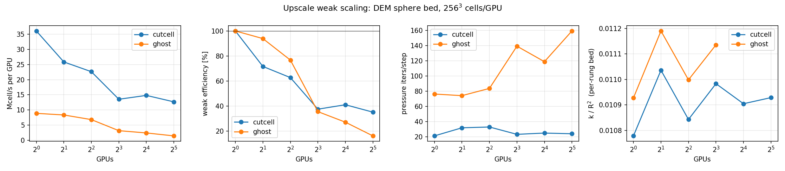
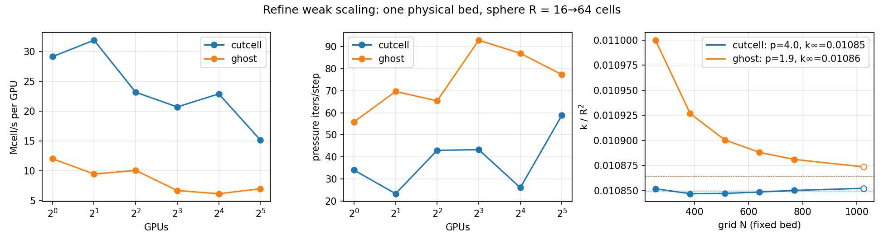

Weak-scaling study of the full IBM pressure path on a physical porous medium: spheres grown to a
target solid fraction with `peclet.dem` (XPBD growth mode, periodic box), then creeping flow
through the bed with `peclet.flow`, cut-cell **and** ghost-cell IBM. Companion to the
[all-fluid TGV study](../parallel-scaling/index.qmd); where TGV measures the solver floor, this
measures what a real geometry costs — and adds a physics observable, the bed permeability
$k/R^2$, whose convergence the ladders expose.

## Pipeline

1. **`pack_bed.py`** — grow $N$ spheres ($R{=}1$) in a periodic box to solid fraction
   $\phi = 0.50$; the artifact is the *sphere list* (centers + scales, a small npz), not an SDF.
2. **`spheres_bench.py`** — every MPI rank samples the analytic union-of-spheres SDF over its own
   block (periodic images included), so one packing serves any grid resolution and nothing global
   is gathered. Phase A measures per-step cost (warmup-excluded, per-phase breakdown, pressure
   iterations, allreduce time); phase B marches to steady state and records $k/R^2$.

## Ladders

**Upscale** (`snellius/spheres_weak_gpu.sh`): 256³ cells/GPU held fixed, the domain — and the
packing in it — doubles with the GPU count (1→32 GPUs, 16.8M→537M cells, 489→15.6k spheres,
sphere radius fixed at 16 cells, per-rung seeds). Blocks tile exactly, so the decomposition is
perfectly balanced at every rung. Permeability should be domain-size independent here (an RVE
check); iterations/step should be flat — the agglomerated coarse solve (`set_pressure_bottom
auto`) handles the growing global bottom exactly.

**Refine** (`snellius/spheres_refine_gpu.sh`): one fixed physical bed (16³ R-units, seed 100),
grid refined 256³→1024³ with the GPU count; the sphere radius spans 16→64 cells. Cells/GPU varies
(3-D refinement can't hold it), so weak efficiency reads from per-GPU throughput. The physics
payoff: $k(N) \to k_\infty$ per IBM with its observed order — and the cut-cell and ghost-cell
estimates of $k_\infty$ must agree.

**Levers** (at the largest allocation): legacy smoothed bottom vs the agglomerated default,
GPU-aware vs host-staged MPI.

## Results (Snellius gpu_h100, 2026-08)



**Upscale.** Cut-cell pressure iterations are *flat* across the ladder (21–33/step, 1→32 GPUs,
16.8M→537M cells) — the agglomerated coarse solve + exactly-tiling decomposition deliver the
grid-independent solve on a real porous geometry. Per-GPU throughput drops 36→13 Mcell/s from
1→8 GPUs (halo + allreduce cost appearing), then holds flat 8→32: the scaling loss is a
fixed communication toll, not a growing one. Permeability is domain-size independent as an RVE
should be: every converged rung sits in $k/R^2 = 0.0108$–$0.0112$ (per-rung random beds; the
scatter is bed statistics, not solver noise). Ghost-cell tracks cut-cell physics on the rungs
that converge, at roughly 4× the iterations and ~⅓ the throughput.



**Refine.** The physics headline: on one fixed bed refined 256³→1024³ (sphere radius 16→64
cells), cut-cell $k/R^2$ is already converged at the coarsest grid — flat at $0.01085$ to four
digits — while ghost-cell approaches the same value from above at observed order ≈1.9. The two
IBMs' independent $k_\infty$ estimates agree to **0.1%** ($0.01086$ vs $0.01085$) — a strong
cross-validation of both discretizations. Open markers are marches that hit the 400-step cap on
the plateau (1024³); they sit on the fit.

**Levers** (32 GPUs, 537M cells): host-staged MPI is ~7% *faster* per step than GPU-aware UCX
(1236 vs 1323 ms) at this size — the GPU-aware path buys nothing here; and the smoothed vs
agglomerated bottom is a wash (24.2 iters/step both) at this box/depth — the agglomerated
bottom's win lives in deeper hierarchies and long boxes (see the channel-scaling study), while
costing nothing here.

## Incidents & open issues (found by this study)

- **dem packing corruption on H100** (open, dem bug): the CUDA 12.6/sm_90 build of `peclet.dem`
  deterministically fails to resolve contacts for certain box/φ configurations (e.g. cubic
  32 R-units at φ=0.50 — but *not* φ=0.48; probes `snellius/probe_dem*.sh`) — spheres grow
  through each other while the solver's own overlap metric stays quiet. The **same seeds pack
  correctly on the CPU backend of the same machine** and on CUDA 13.2/sm_120. Both pipeline ends
  now gate on an independent voxelized solid fraction, and the corrupted-bed specimens are kept
  (`*.BAD.npz`). Until fixed: pack on Snellius with `DEM_BUILD=$SUITE/dem/build_omp`.
- **Ghost-projection march instability at scale** (open, flow bug): the ghost IBM steady march
  diverges at the np=16/32 upscale rungs (large, elongated domains) with per-solve convergence
  intact — iteration counts identical under PMAXIT 300 vs 600, both bottom modes. The refine
  ladder (cubic, same peak cell count) is stable. Likely related to the warmstart divergence on
  steady marches; needs a flow-side investigation.
- The perf-phase numbers of the diverged ghost runs are valid (divergence builds over hundreds
  of march steps) and are included in the scaling panels; their $k$ values are excluded.

## Reproducing

```bash
# workstation shakedown (any MPI flow build; dem build for the packing)
GNX=256 GNY=256 GNZ=256 RCELLS=16 SEED=100 OUT=pack.npz python pack_bed.py
PACK=pack.npz mpirun -np 2 python spheres_bench.py

# Snellius: one job per rung (queue-parallel safe), argument = GPU count
sbatch --nodes=1 snellius/spheres_weak_gpu.sh 1
sbatch --nodes=8 snellius/spheres_weak_gpu.sh 32
sbatch --nodes=8 snellius/spheres_weak_gpu.sh levers
sbatch --nodes=1 snellius/spheres_refine_gpu.sh 1
```

Pre-flight any grid/rank-count change with `flow/scripts/check_decomposition.py` before spending
queue time.
