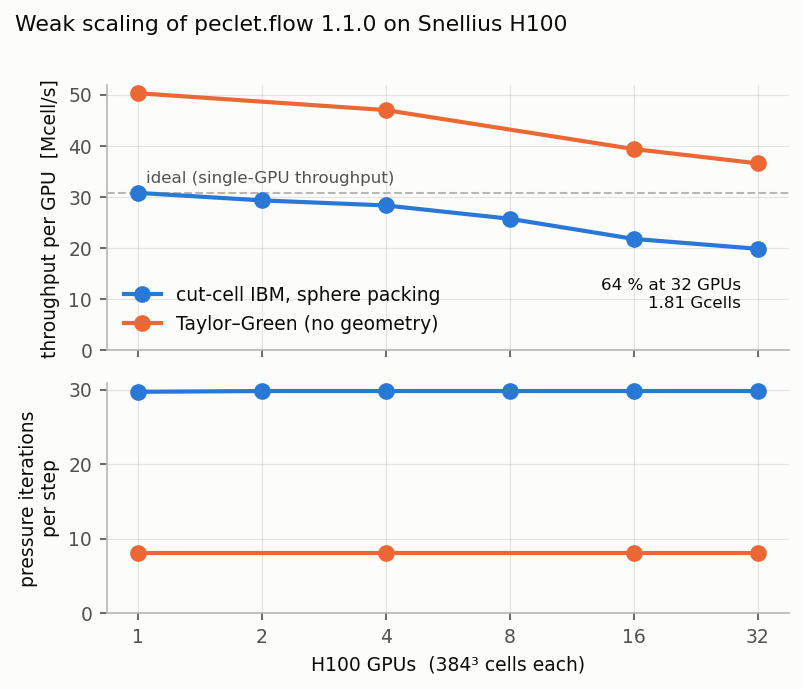
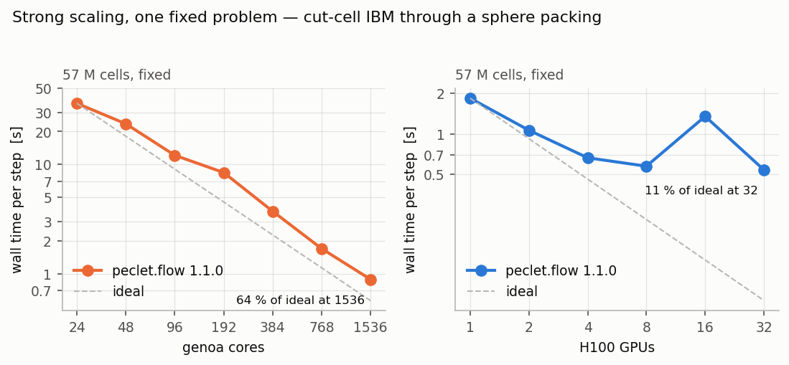
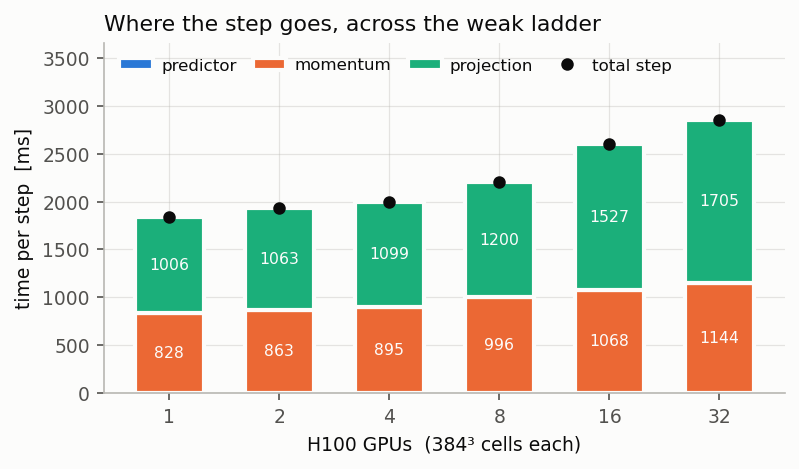

This page is the human-readable face of a citable record: the archived dataset carries the driver,
the geometry, the cluster scripts, every raw result and the analysis that turns them into these
tables. It states what **peclet.flow 1.1.0** does on the hardware it was measured on. It is
not a comparison against other codes, and it makes no claim about any other version.

## What is measured

**Creeping flow through a periodic random sphere packing, with the cut-cell immersed boundary
method**, driven by a body force in a triply periodic box. One MPI rank per GPU or per core.

The physical unit of the study is a **unit cell**: 1043 spheres of radius $R = 1$ at solid fraction
$\phi = 0.45$ in a cubic box of $21.333\,R$, resolved at $384^3$ cells — so $R = 18$ cells,
comfortably inside the resolution at which this discretization's permeability has converged. That
cell is 56.6 M cells, and it is what one H100 holds.

Four ladders, one case:

| Ladder | Machine | What changes | Rungs |
|---|---|---|---|
| **Weak** | Snellius `gpu_h100` | one unit cell **per GPU**, the domain grows with the GPU count | 1 → 32 GPUs, 56.6 M → 1.81 Gcells |
| **Strong (CPU)** | Snellius `genoa` | one fixed unit cell, more cores | 24 → 1536 cores |
| **Strong (GPU)** | Snellius `gpu_h100` | one fixed unit cell, more GPUs | 1 → 32 GPUs |
| **Control** | both | Taylor–Green vortices, no geometry, same grids | subset |

The weak ladder **tiles one unit cell**. Rung $N$ is an exact periodic replication of the same
problem, $N$ times over — the porous-media analogue of tiling vortices. That choice is what makes
the physics observable exact rather than statistical: the tiled problem *is* the same problem, so
its answer must be the same number, and any disagreement is a defect rather than bed-to-bed
scatter.

## Correctness first

Every run starts from rest and takes the same 13 steps, so the mean velocity
$\langle u \rangle$ at the end is one number that every rung must return — at any rank count, on
either machine. It costs one global reduction, and it is checked for every run in the record.

::: {.callout-important title="One state, 34 runs, two machines"}
$\langle u \rangle = 1.638890208586e-04$

across **34 runs** spanning 1 to 1536 ranks, both the CUDA and the OpenMP
backend, single-rank and distributed, and domains from 56.6 M to
1.81 billion cells. Worst relative deviation **8e−11**; peak divergence
3e-14. The geometry-free control is tighter still: **4e−16** — machine
epsilon — over 7 runs to 1536 ranks.
:::

That is the claim the timings rest on. A fast rung that has quietly stopped solving the same
problem is worth nothing, so the equivalence is established first and the performance is read only
from runs that pass it.

**One solver, every rung.** 1.1.0 chooses the momentum solver from the implicit-diffusion
operator's condition number, $\kappa = 1 + 12D$ on an isotropic grid, taking the velocity multigrid
at $\kappa \ge 13$. This case runs at $D = 6$, so
$\kappa = 73$ — far above the threshold — and the criterion depends on `dt`, $\mu$, $\rho$
and $h$, **not on the rank count**. Every one of the 42 runs in this record therefore
reports the same solver, `multigrid`, from one core to 32 GPUs and from 24 to
1536 cores.

That is worth stating because it is what makes the ladders comparable end to end: a ladder whose
solver changes partway up is measuring two algorithms and reporting one number. Here the gate
compares like with like at every rung, and the only configuration deliberately held apart is the
multigrid-depth control described under [Reading the numbers fairly](#reading-the-numbers-fairly).


## Weak scaling — the distributed solve



Per-GPU throughput goes from **30.8** to **19.8 Mcell/s** between 1 and
32 GPUs: **64 % weak efficiency** at 1.81 billion cells, an
aggregate 634 Mcell/s. The pressure solve takes **29.7 iterations per
step at 1 GPU and 29.8 at 32** — flat, which is the property that matters: a
weak ladder whose iteration count climbs is not weak-scaling, however level its throughput curve
looks. The multigrid hierarchy reaches 8 levels and the coarse levels telescope onto
fewer ranks as they shrink, so the coarsest grid stays solvable however many ranks the fine grid
is spread over.

## Strong scaling — one fixed problem



On CPU, 24 → 1536 cores takes the step from 36.3 s to
**0.89 s**, a **40.9×** speedup — **64 % of ideal** across a 64-fold
increase in cores. The one thing to discount is the baseline: the sub-node rungs
(24, 48, 96) take exclusive nodes and so have up to 8× the memory bandwidth per rank of
the full-node rungs, which flatters the reference and therefore *understates* the efficiencies
computed against it. The apples-to-apples segment is 192 → 1536.

On GPU the same problem goes from 1.8 s on one H100 to **0.54 s on 32**
(3.4×, 11 % of ideal). The efficiency falls off where it should: at
32 GPUs each device holds only 1.8 M cells, far below what saturates an
H100, and the step becomes a latency problem rather than a throughput one. **That is the honest
limit of strong scaling on this hardware, and it is why the weak ladder is the headline** — a GPU
earns its keep on a large subdomain, and the fixed problem here fits on one of them to begin with.

One rung does not behave, and it is the most solid negative result in this record. At
**16 GPUs the step takes 1349 ms against 574 ms at 8 and
539 ms at 32** — 2.3× slower than *both* its neighbours, on a ladder
where the work is fixed. It is not a bad allocation: 4 separate allocations agree to
1.02×.

Both phases inflate and both recover: the momentum solve runs
267 → **816** → 270 ms and the projection
306 → **533** → 270 ms across the three rungs.

**The decisive measurement is that the solver does exactly the same work at all three.** The
momentum solve takes 29 / 29 / 29 sweeps at 8 / 16 / 32 GPUs — identical — and the
pressure solve holds at 29.7 iterations throughout. So 16 GPUs is not
converging differently, or more slowly, or at all differently: it performs the *same* iterations and
each one costs about three times as much. That moves the question out of the discretization and the
solver entirely, and into how the work executes.

What the measurements rule out, each from this record's own data:

- **not node placement** — 4 allocations on different node sets, agreeing to
  1.02×;
- **not convergence** — 29 momentum sweeps and 29.7 pressure iterations at
  every rung;
- **not the multigrid hierarchy** — all three build 8 levels with identical level ratios
  and the same telescoping;
- **not the decomposition shape** — the level-0 block goes 192x192x192 → 96x192x192 →
  96x96x192 and its surface-to-volume ratio is *monotone* (0.0312 → 0.0417 → 0.0521,
  `hierarchy_predict.txt`), yet the most elongated, worst-ratio rung at 32 GPUs is the
  **fastest** on the ladder. A monotone quantity cannot produce a non-monotone dip;
- **not the global reduction** — the timers put the all-reduce at 1.0 % of the
  projection.

The anomaly is real, reproducible, confined to a single rank count, present in both phases, and
**undiagnosed**. It is reported rather than smoothed because a reader sizing a job at this scale
should know the ladder has a hole in it, and because the negative results above are what a
diagnosis would have to survive.


## Where the step goes



The step is two solves and a negligible explicit stage (the predictor is 5.1 ms,
about a tenth of a percent). Across the weak ladder the **momentum solve grows
38 %** (828 → 1144 ms from 1 to 32
GPUs) while the **pressure projection grows 70 %**
(1006 → 1705 ms). The iteration count is flat, so the gap is
not a convergence effect.

## The geometry-free control

The Taylor–Green control runs the identical grids and the identical decomposition with no geometry
at all. It is **not** a measurement of what the immersed boundary costs, and should not be read as
one: the control solves an advecting flow while the bed case is creeping (advection off), so the
two differ in the physics as well as in the geometry.

What it does isolate is the solver floor and the shape of the scaling. Two things follow. The
cut-cell pressure operator needs **3.7×** the iterations of the all-fluid one
(29.7 against 8.0), which is what a matrix whose coefficients span the
aperture contrast of a dense bed costs. And the whole step nevertheless lands within
**1.6×** of the control's, because the control spends on advection roughly what the bed
spends on its stiffer pressure solve. The control also weak-scales slightly better
(73 % against 64 % at 32 GPUs), which puts a number on how much
of the loss at the top of the ladder is the geometry's irregular work rather than the
communication both cases share.

## Permeability

Marched to steady state, the unit cell has $k/R^2 = 0.017122$ (40 steps to a
relative tolerance of $10^{-5}$). Measured at 3 points of the ladder, the estimates agree
to 5e−13 — the same physical answer from the single-GPU cell and from the tiled
1.81-billion-cell domain.

## Results in full



## Reading the numbers fairly

- The CPU rungs take **exclusive** nodes, so the sub-node rungs (24, 48, 96) have up to
  8× the memory bandwidth per rank of the full-node rungs. That flatters the baseline and therefore
  **understates** the efficiencies computed against it; the apples-to-apples segment is 192 →
  1536.
- The weak ladder's large rungs are **periodic replications** of one unit cell, not independent
  beds. That is what makes the physics gate exact; it is not a statement about bed-to-bed
  variability.
- Timings are the **median** of 10 timed steps after 3 warm-up steps, taken
  as the slowest rank's wall time for each step. The per-run spread is in the tables; repeats of
  the top rungs on separate allocations are reported separately, because node placement moves a
  large-rank number by more than the solver does.
- The configuration is the **shipped 1.1.0 default** — MG-PCG at a relative tolerance of
  $10^{-8}$, coarse-level telescoping, the agglomerated coarse solve, the condition-number
  rule that selects the momentum solver, double operator storage, and the shipped auto-detection of GPU-aware MPI — with **one
  stated exception**: the pressure multigrid is asked for as much depth as the grid admits rather
  than the default of four levels. Depth is a property of the grid, not a tuning constant, and the
  cost of treating it as one is measured here rather than argued: the same 8-GPU weak
  rung run at the default four levels takes **179 435 ms per step against 2 202 ms**
  at full depth — a factor of 81× — at an unchanged iteration count. That run is in
  the tables and is excluded from every ladder.
- `PECLET_CORE_GPU_AWARE_MPI` is deliberately left unset, so the shipped auto-detection decides the
  halo transport and the runs record what it chose: on this machine, **DEVICE MPI buffers (auto)**.
- Runs whose pressure solve touched its iteration cap would be reported as capped rather than
  plotted as timings. None did: the worst rung used a small fraction of the cap.

## Reproduce it

The published wheels cannot run this — MPI is a build-time option in `flow` and the PyPI wheels are
single-rank — so the study builds the released tag from source, with one tree per backend.

```bash
git clone https://github.com/computational-chemical-engineering/peclet-examples
cd peclet-examples/benchmarks/release-1.1.0-scaling

sbatch --nodes=1 --gpus-per-node=1 --ntasks-per-node=1 snellius/install_bench.sh v1.1.0 h100
sbatch -p genoa --gpus-per-node=0 -c 32 -t 02:00:00    snellius/install_bench.sh v1.1.0 cpu

./snellius/submit_ladders.sh pilot     # the go/no-go rungs
./snellius/submit_ladders.sh weak      # and strong-gpu, strong-cpu, tgv, march, spread, levels
python analyze.py results              # tables, gates, figures
```

The runbook is [`README.md`](https://github.com/computational-chemical-engineering/peclet-examples/blob/main/benchmarks/release-1.1.0-scaling/README.md); the design decisions, including the ones that
were rejected, are in [`DECISIONS.md`](https://github.com/computational-chemical-engineering/peclet-examples/blob/main/benchmarks/release-1.1.0-scaling/DECISIONS.md). The whole directory — driver, geometry,
cluster scripts, raw results and logs — is
[on GitHub](https://github.com/computational-chemical-engineering/peclet-examples/tree/main/benchmarks/release-1.1.0-scaling).

## Cite

The measurement in this page — the driver, the geometry, the cluster scripts, every raw result and
log, and a standalone report — is archived as a dataset with its own DOI, separate from the
software it measures. Cite the record's **concept DOI** rather than a version DOI, so the reference
follows later campaigns instead of going stale, and cite
[peclet itself](https://doi.org/10.5281/zenodo.21132445) for the software.

*The DOI is added here when the deposit is published; until then this page and the repository
directory are the record.*
