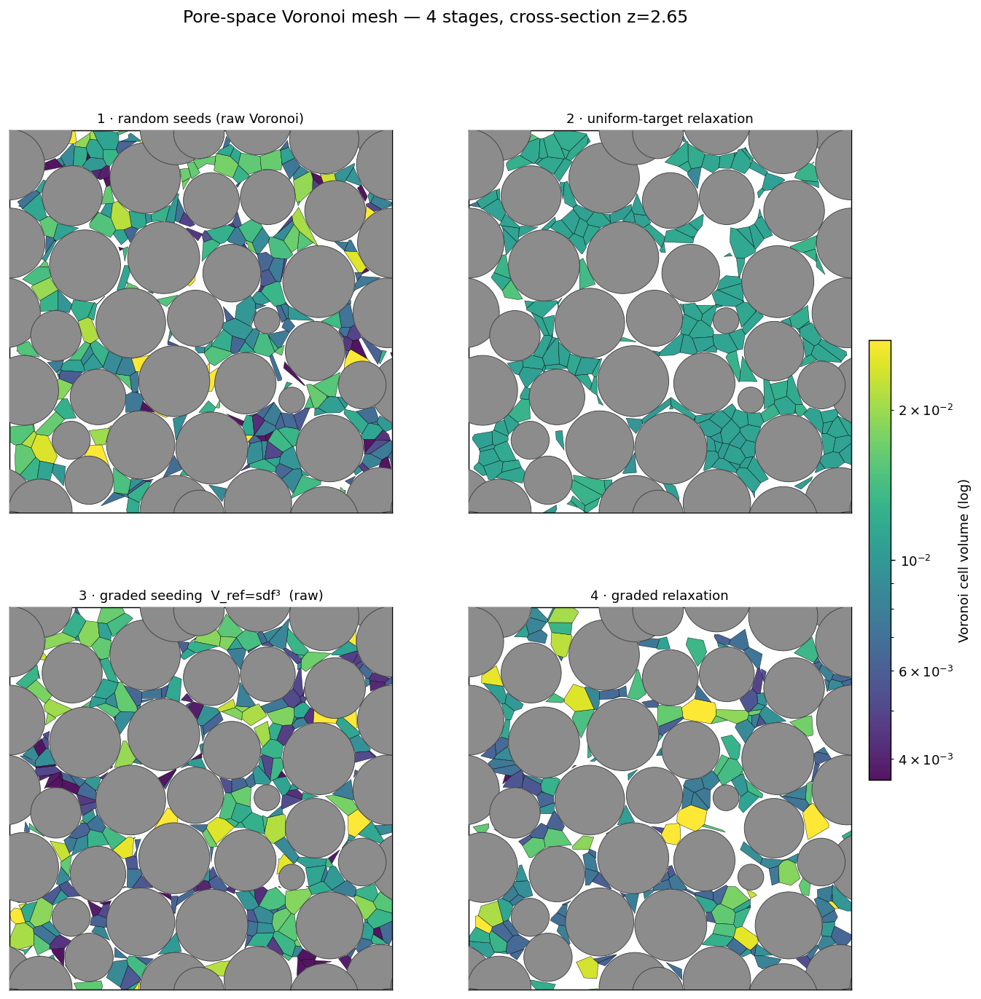
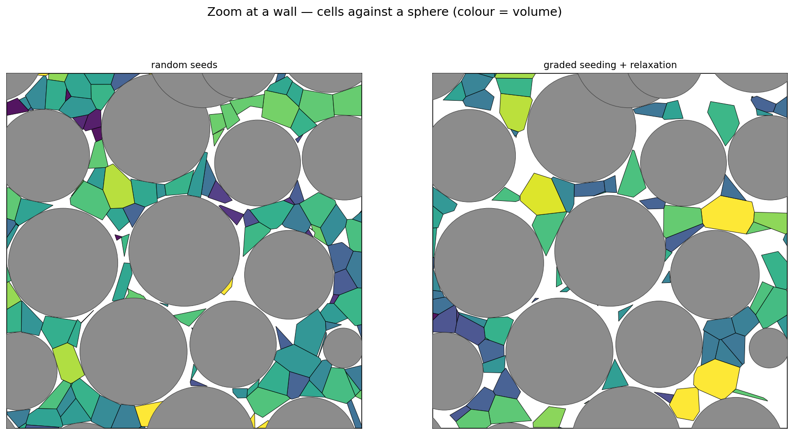
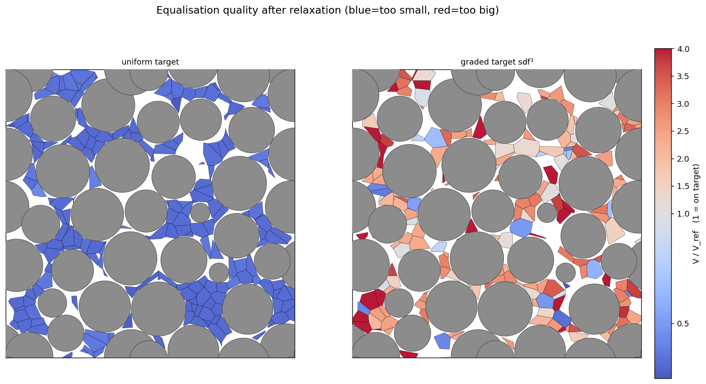

::: {.callout-warning}
**Work in progress / diagnostic.** This uses the experimental SDF-walled mesh optimiser in
`peclet.voro` (not yet in the released Python API), driven by a small C++ tool. It is here to *see*
what happens at the walls and decide how to finish the method — not as a finished, Colab-runnable
gallery example. Two known issues are visible in the figures and discussed at the end.
:::

## The idea

Take a random close packing of spheres (built with `peclet.dem`) and mesh the **fluid** between them
with a Voronoi tessellation: drop seed points into the interstitial space, tessellate, and **clip each
cell against the sphere surfaces** (the SDF walls). Then *move the seeds* to drive the cell volumes
toward a per-cell target `V_ref`:

- **uniform `V_ref`** → an equal-volume pore mesh;
- **graded `V_ref = clamp(sdf, s_lo, s_hi)³`** → small cells hugging the walls (a boundary-layer /
  *inflation layer*) growing to a coarser bulk size. `sdf` is the distance to the nearest sphere, so
  `sdf³` is a target cell *volume* that shrinks toward the wall.

The relaxation minimises a volume energy over the seed positions; the "free-energy" form
`E = −Σ V_ref·log V` is especially natural — its constant-pressure equilibrium is exactly `V ∝ V_ref`.

## Four stages

We render a `z`-slice of the 3-D clipped Voronoi cells (grey discs = spheres cut by the plane):

1. **random** — uniform interstitial seeds, raw Voronoi.
2. **uniform relaxation** — stage-1 seeds relaxed toward one `V_ref`.
3. **graded seeding** — seeds placed with density `∝ 1/V_ref` (dense at the walls), raw.
4. **graded relaxation** — stage-3 seeds relaxed toward `V_ref = sdf³`.



The **graded seeding (3)** is what we want structurally: a ring of small cells around every sphere,
larger cells in the open pores. The **relaxed stages (2, 4)** move the seeds but also lose cells to
collapse — the white gaps.

## What happens at the wall

Zooming onto one sphere makes the wall behaviour explicit:



Colouring the two *relaxed* meshes by `V/V_ref` (renormalised so `1` = on target) shows the
equalisation quality:



The graded target is *broadly achieved* (right panel mostly pale, with red only in the throats it
can't fill); the uniform target is not (left panel: the pore geometry is too heterogeneous for
equal-volume cells without moving seeds between pores).

## Two open issues this exposes

1. **Cell collapse in tight throats.** Some interstitial pockets are too small to hold a cell of the
   target size; during relaxation those cells shrink to zero (the gaps). A log-barrier /
   free-energy `−log V` term resists this, but from a random seeding the position-only optimiser
   still can't move seeds *between* pores, so it collapses cells instead. The fix is on the seeding
   side — density-graded seeding (which stage 3 does) so the initial cells already match `V_ref` and
   the optimiser only refines locally.
2. **Wall-gradient accuracy.** The cell-volume gradient's wall term is exact for a flat wall but only
   first-order for a curved (sphere) wall. With the delicate free-energy gradient this dominates the
   step direction and the relaxation stalls — the next thing to make exact.

*(Some of the white gaps in the figures are also a visualisation artefact: the exporter reconstructs
each clipped cell independently for rendering, and a large open-pore cell can fail to re-bound. The
optimiser's own cells are cleaner than the render suggests.)*

## Reproduce

Needs the local `suite` checkout (voro built with a Kokkos OpenMP prefix), not the PyPI wheel:

```bash
# 1. packing (peclet.dem)  -> packing.txt  ("<Nsph> <L>" then "x y z r" per sphere)
cd suite/voro/examples/packed_bed_voronoi
PYTHONPATH=../../../dem/build python pack_bed.py 180 packing.txt

# 2. build + run the 4-stage tool  -> stage{1..4}_*.vtu + spheres.txt
cmake -B build -DCMAKE_PREFIX_PATH="$PWD/../../../extern/install/host-openmp" -DCMAKE_BUILD_TYPE=Release
cmake --build build --target pore_mesh_stages -j
OMP_NUM_THREADS=8 ./build/pore_mesh_stages packing.txt out 4000

# 3. visualise (vtk + matplotlib)  -> out/stages_{volume,wall_zoom,rel}.png
python plot_stages.py out
```

The C++ driver (`pore_mesh_stages.cpp`), the packing script, and the plotter live in
`suite/voro/examples/packed_bed_voronoi/`.
