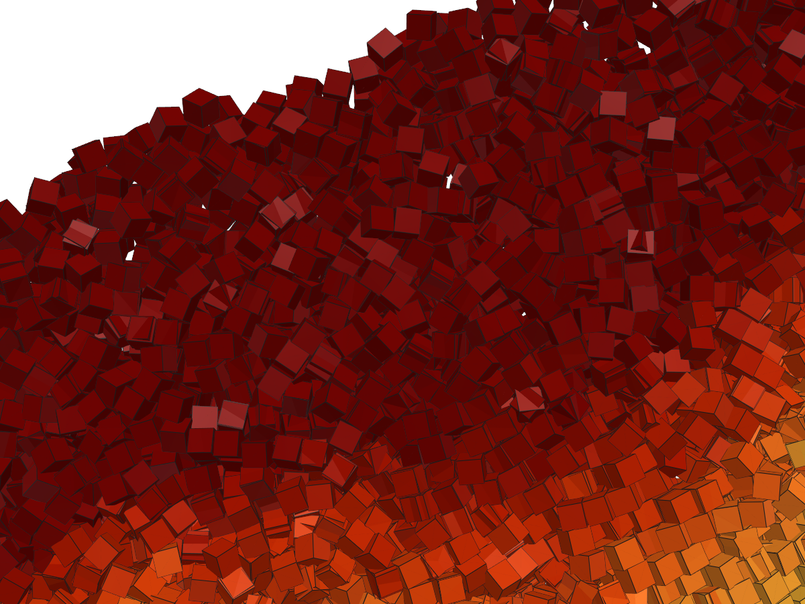

::: {.callout-note appearance="simple"}
This is a **GPU showcase**: the drum below holds tens of thousands of cubes and runs on a
CUDA/HIP build of `peclet.dem` (an RTX 5080 here). The hero movie is pre-rendered; the small
in-notebook run needs a GPU build (`PECLET_LOCAL_BUILD`) — it is far too heavy for a free Colab CPU.
:::

## What you'll learn

`peclet.dem` is not limited to spheres — a particle is a **shape + a surface-point shell**, and the
built-in **cube** (`initialize_shape(3, …)` (3 = BOX)) collides *every face* against its neighbours and against
the moving [SDF wall](../rotating-drum/index.qmd). Cubes behave nothing like spheres: they **cannot
roll**, so they **tumble and interlock**, and the collision solver has to resolve many contacts per
grain. You will:

1. Fill a drum with tens of thousands of **hard cubes** and spin it into the **cascading regime**.
2. Export the **configuration** — every grain's position *and orientation* per frame — so it can be
   rendered by any 3-D tool.
3. See the cascade rendered as **shaded, oriented cubes**.

## The result — 30 000 cubes cascading

Wall friction drags the packed cube bed up the rising side; a loose surface layer continuously
**tumbles** back down. Every grain is a real cube, shaded and oriented by the simulation, coloured by
speed (fast surface flow → slow rotating core). The camera pushes in to individual grains:

::: {.column-page}
<video controls autoplay loop muted playsinline width="100%" style="max-width:820px;display:block;margin:0 auto;border-radius:6px;">
  <source src="cubes_drum.mp4" type="video/mp4">
</video>
:::

{width=100%}

## How it's built

```{python}
#| label: bootstrap
#| code-summary: "Environment bootstrap (needs a GPU build of peclet for the live run)"
import importlib.util, os, subprocess, sys
_local = os.environ.get("PECLET_LOCAL_BUILD")
if _local:
    for p in _local.split(os.pathsep):
        sys.path.insert(0, p)
elif importlib.util.find_spec("peclet") is None:
    subprocess.run([sys.executable, "-m", "pip", "install", "-q", "peclet"], check=True)
```

```{python}
import numpy as np, time
import matplotlib.pyplot as plt
from matplotlib.collections import PolyCollection
from peclet import dem
from peclet.dem import build_wall_sdf
plt.rcParams.update({"figure.dpi": 130, "font.size": 10, "figure.facecolor": "white",
                     "savefig.bbox": "tight"})
print("peclet.dem backend:", dem.execution_space)
```

A cube is one call: `initialize_shape(3, half_extent)` (shape 3 = BOX). The drum is a **z-periodic SDF barrel**
(no end caps — a cube corner would slip through the sharp barrel/cap join, exactly as a sphere does),
resolved finer than a cube so nothing tunnels. We spin at Froude number `Fr = ω²R/g ≈ 0.4` — the
cascading regime. Here we run a **modest** count so the page builds in a minute; the hero movie above
is the same recipe at 30 000.

```{python}
g, dt, he = 9.8, 0.003, 0.9                       # gravity, timestep, cube half-extent (side 1.8)
Ntarget, Lz = 4000, 5.0
R = np.sqrt(Ntarget*(2*he)**3 / (0.60*0.42*np.pi*Lz)); cx = cy = R + 3.0
lo, hi = (0, 0, 0), (2*cx, 2*cy, Lz)

def barrel(p):                                    # + inside the void, − in the wall (z-periodic, no caps)
    return R - np.hypot(p[:, 0]-cx, p[:, 1]-cy)

grid = np.arange(cx-R+1.5, cx+R-1.5, 2.1); gz = np.arange(1.0, Lz-0.9, 2.1)
pts = np.array([(x, y, z) for z in gz for x in grid for y in grid
                if (x-cx)**2 + (y-cy)**2 < (R-1.8)**2 and y < cy-R+0.42*2*R], np.float32)
N = len(pts)

sim = dem.Simulation(int(1.6*N)+2000)
sim.initialize_shape(3, he)                     # 3 = BOX (cube)
sim.set_domain(lo, hi); sim.enable_periodicity(False, False, True)
res = (int(2*cx/0.5), int(2*cy/0.5), max(6, int(Lz/0.5)))
wid = build_wall_sdf(barrel, (lo, hi), resolution=res).add_to(sim, restitution=0.2, friction=1.0)
sim.set_gravity(0, -g, 0); sim.set_material_params(0.2, 0.0, 0.5); sim.set_solver_iterations(18, 6)
p = np.zeros((N, 4), np.float32); p[:, :3] = pts; p[:, 3] = 1.0
sim.set_positions(p)                              # axis-aligned seed (random orientations would overlap)
for _ in range(1100):
    sim.step(dt)
print(f"packed {N} cubes (half-extent {he}); {sim.num_contacts()} contacts — every cube face resolved")
```

Spin the wall, and **record the configuration** — positions **and quaternions** — each frame. That
stream of `(position, orientation, speed)` is all a renderer needs.

```{python}
omega = np.sqrt(0.4*g/R)                           # Fr = 0.4
sim.set_wall_velocity(wid, lin_vel=(0, 0, 0), ang_vel=(0, 0, omega), center=(cx, cy, 0))
rev = int(2*np.pi/omega/dt)
for _ in range(rev//7):                            # let the cascade establish
    sim.step(dt)

config = []                                        # <-- the exported configuration
for f in range(48):
    for _ in range(max(1, rev//220)):
        sim.step(dt)
    config.append((sim.get_positions().reshape(-1, 3).copy(),
                   sim.get_quaternions().reshape(-1, 4).copy(),
                   np.linalg.norm(sim.get_velocities().reshape(-1, 3), axis=1)))
pos, quat, spd = config[-1]
esc = int((np.hypot(pos[:, 0]-cx, pos[:, 1]-cy) > R+2).sum())
print(f"recorded {len(config)} frames; escaped the barrel: {esc} / {N}")
# np.savez("drum_cubes.npz", pos=[c[0] for c in config], quat=[c[1] for c in config], ...)  # to disk
```

## A quick 2-D look (in-notebook)

Viewed down the axis, each cube is an **oriented square** — you can see the angular grains tumbling
and the steep, interlocked pile that spheres never make. (The hero movie above renders the same
configuration as shaded 3-D cubes.)

```{python}
#| label: fig-cubes2d
#| fig-cap: "The cube bed viewed down the drum axis — each grain drawn as an oriented square, coloured by speed. The angular grains interlock into a steep cascade."
def inplane_angle(q):                              # in-plane rotation of each cube's local x-axis
    x, y, z, w = q[:, 0], q[:, 1], q[:, 2], q[:, 3]
    return np.arctan2(2*(x*y+z*w), 1-2*(y*y+z*z))
def squares(x, y, ang, s):
    c = np.array([[-1,-1],[1,-1],[1,1],[-1,1]], float)*s
    ca, sa = np.cos(ang), np.sin(ang)
    rot = np.stack([np.stack([ca,-sa],-1), np.stack([sa,ca],-1)], -2)
    return np.einsum('nij,cj->nci', rot, c) + np.stack([x, y], -1)[:, None, :]

fig, ax = plt.subplots(figsize=(5.2, 5.2))
th = np.linspace(0, 2*np.pi, 200); ax.plot(cx+R*np.cos(th), cy+R*np.sin(th), "k-", lw=1.3)
pc = PolyCollection(squares(pos[:, 0], pos[:, 1], inplane_angle(quat), he),
                    array=spd, cmap="turbo", edgecolors="k", linewidths=0.25)
pc.set_clim(0, np.percentile(spd, 96)); ax.add_collection(pc)
ax.set_xlim(cx-R-2, cx+R+2); ax.set_ylim(cy-R-2, cy+R+2); ax.set_aspect("equal"); ax.axis("off")
ax.set_title(f"{N} tumbling cubes, ω = {omega:.2f}")
plt.show()
```

## Rendering shaded 3-D cubes from the configuration

The movie at the top was made **offline** from the exported `(position, orientation)` stream with
[PyVista](https://pyvista.org) (VTK) — no dependency is added to `peclet`. Build one mesh per frame by
rotating a unit cube's 8 corners by each grain's quaternion, colour by speed, and render with lighting:

```{python}
#| eval: false
#| code-summary: "Offline PyVista renderer (pip install pyvista imageio-ffmpeg)"
import pyvista as pv, imageio.v2 as imageio, numpy as np
pv.OFF_SCREEN = True
C = np.array([[-1,-1,-1],[1,-1,-1],[1,1,-1],[-1,1,-1],[-1,-1,1],[1,-1,1],[1,1,1],[-1,1,1]], float)*he
QF = np.array([[0,3,2,1],[4,5,6,7],[0,1,5,4],[1,2,6,5],[2,3,7,6],[3,0,4,7]])   # 6 quad faces
faces = np.hstack([np.full((len(QF),1),4), QF]).astype(np.int64)
def qmat(q):
    x,y,z,w = q.T
    return np.stack([1-2*(y*y+z*z),2*(x*y-z*w),2*(x*z+y*w), 2*(x*y+z*w),1-2*(x*x+z*z),2*(y*z-x*w),
                     2*(x*z-y*w),2*(y*z+x*w),1-2*(x*x+y*y)], -1).reshape(-1,3,3)
frames = []
for (P, Q, S) in config:                                    # the recorded configuration
    verts = (np.einsum('nij,cj->nci', qmat(Q), C) + P[:, None, :]).reshape(-1, 3)
    f = (faces[None] + np.array([0,1,1,1,1])*(np.arange(len(P))*8)[:, None, None]).reshape(-1)
    mesh = pv.PolyData(verts, f); mesh.cell_data["speed"] = np.repeat(S, 6)
    pl = pv.Plotter(off_screen=True, window_size=(960, 760)); pl.background_color = "white"
    pl.add_mesh(mesh, scalars="speed", cmap="turbo", show_edges=True, edge_color="black")
    pl.enable_lightkit(); pl.view_xy()
    frames.append(pl.screenshot(return_img=True)); pl.close()
imageio.mimsave("cubes_drum.mp4", frames, fps=20)
```

## Scale — how many cubes?

Each cube carries a shell of ~100 surface points; the ArborX broad-phase plus per-point SDF narrow-
phase all run on the device. On an RTX 5080 the step cost scales gently with grain count:

| cubes | ms / step | grain-steps / s |
|------:|----------:|----------------:|
| 4 000 | ~2 | 2 M |
| 30 000 | ~4 | 8 M |
| **100 000** | **~10** | **11 M** |

So a **hundred thousand** hard cubes step in ~10 ms — a full drum run (fill + spin + record) is a
couple of minutes of wall-clock. The bottleneck for *bigger* drums is the number of steps per
revolution (a larger drum spins slower at fixed Froude number), not the per-step cost.

## Adapt this yourself

- **Other shapes.** `initialize_shape(2, …)` (2 = hollow cylinder) for Raschig rings, or an arbitrary SDF
  via [`build_particle`](../sdf-particle-packing/index.qmd) (rods, beans, rounded cubes). The drum
  code is unchanged — only the grain shape differs.
- **The confinement trick.** Use a **z-periodic barrel** (no end caps): a cube corner tunnels the
  sharp barrel/cap join, so remove it (or round it). Resolve the wall SDF finer than one grain.
- **Render your own way.** The exported `(position, quaternion)` stream feeds any tool — PyVista/VTK
  (above), Blender, or Ovito (write it to a `.vtp`/particle file with orientation).
- **Push the count.** On a bigger GPU or multi-GPU (`sim.init_mpi(...)`), raise the grain count; the
  per-step cost stays ~linear in the number of grains.

## Reproduce this

```bash
# needs a CUDA/HIP build of peclet.dem (this page was frozen on an RTX 5080):
PECLET_LOCAL_BUILD=/path/to/suite/dem/build_cuda \
  quarto render examples/tumbling-cubes/index.qmd --execute
# the shaded-cube movie is rendered offline from the exported configuration (see above).
```
