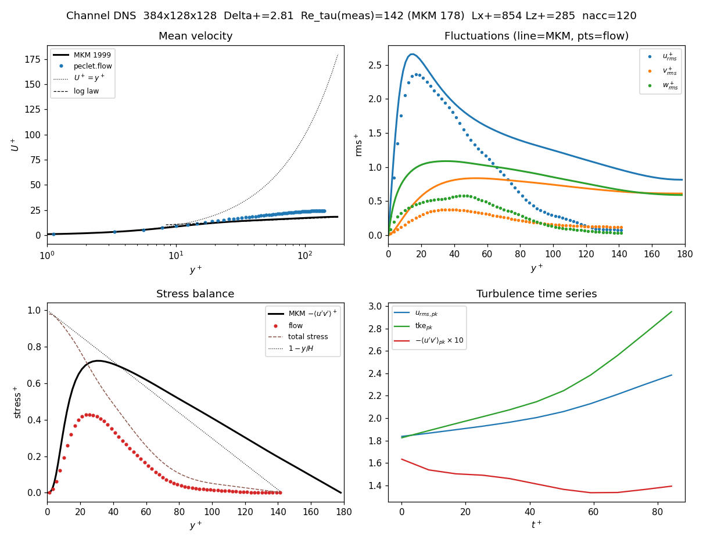

## What you'll learn

How to run a **direct numerical simulation (DNS) of turbulent plane-channel flow** with the
`peclet.flow` solver — the canonical wall-bounded-turbulence testbed — and benchmark it against the
reference database of Moser, Kim & Mansour (@mkm1999) at $Re_\tau = 180$. You'll see how to drive the
channel (constant pressure gradient vs constant flow rate), how the statistics are gathered in **wall
units**, and — the focus of the second half — **how to size and launch the full-resolution run on the
Snellius supercomputer**, multi-GPU or multi-core, including install, job scripts, and how many
nodes/GPUs it takes and for how long.

This example is also honest about a solver limitation and turns it into the physics lesson: `peclet.flow`
uses **upwind advection on an isotropic grid**, so on a coarse grid numerical dissipation damps the
turbulence — and the cure is resolution, which is exactly what motivates going to HPC.

## The problem

Plane channel flow: incompressible flow between two parallel no-slip walls, periodic in the streamwise
($x$) and spanwise ($z$) directions, driven by a uniform body force $f$ that stands in for a mean
pressure gradient. With half-height $H$ and kinematic viscosity $\nu$, the friction velocity
$u_\tau=\sqrt{\tau_w/\rho}$ and the **friction Reynolds number** $Re_\tau = u_\tau H/\nu$ organise
everything. The benchmark case is $Re_\tau=180$.

A global momentum balance makes the driving trivial: at a statistically steady state the wall shear
must balance the body force, $\tau_w = f H$, so **constant-pressure-gradient (CPG) forcing pins
$u_\tau=\sqrt{fH/\rho}$ exactly**. We work in grid units ($\Delta x=\Delta y=\Delta z=1$) and choose
$u_\tau=1$, so every statistic comes out **directly in wall units**: $u^+=u$, $y^+=y/\nu$, and

$$
\nu = \frac{H}{Re_\tau}, \qquad f = \frac{\rho\,u_\tau^2}{H} = \frac{2}{n_y}, \qquad
\Delta^+ = \frac{u_\tau\,\Delta}{\nu} = \frac{360}{n_y}.
$$ {#eq-scaling}

The last identity is the crux for this solver: the grid is **isotropic** (no wall-normal stretching),
so the spacing in *wall units* is the same in every direction, $\Delta^+ = 360/n_y$. A spectral channel
DNS clusters points near the wall (MKM used $128\times129\times128$ with Chebyshev stretching); here every
cell is a cube, which is simpler but means the wall-parallel directions are over-resolved and the total
cell count grows as $n_y^3$.

## The setup in code

The whole driver is [`channel_dns.py`](channel_dns.py) (single-GPU) and
[`channel_dns_mpi.py`](channel_dns_mpi.py) (distributed). The core is a dozen calls:

```python
from peclet import flow
import numpy as np

nx, ny, nz = 384, 128, 128            # reduced box Lx=6H, Lz=2H ; Delta+ = 360/ny = 2.8
nu = (ny/2)/180.0                     # Re_tau = 180
s = flow.Solver(nx, ny, nz)           # staggered MAC, exact projection
s.set_rho(1.0); s.set_mu(nu); s.set_dt(0.012)
s.set_advection(True); s.set_advection_scheme(0)          # 0 = 2nd-order upwind (least dissipative)
s.set_pressure_multigrid(True, 5); s.set_pressure_pcg(True, 80, 1e-4); s.set_pressure_warmstart(True)
s.set_domain_bc(2, 1); s.set_domain_bc(3, 1)              # no-slip walls on -y,+y ; x,z periodic
s.set_body_force(2.0/ny, 0.0, 0.0)                        # CPG: pins u_tau = 1
s.set_pressure_geometry(np.full((nx, ny, nz), 1e30, order='F'))   # all-fluid (domain-BC path)
s.set_state(u0, v0, w0)               # turbulent initial guess (Reichardt mean + near-wall noise)
for it in range(nsteps):
    s.step()
```

We seed with a Reichardt mean profile plus wall-damped low-pass noise so the flow trips to turbulence
and sustains it. Statistics ($\langle U\rangle$, $\langle u'^2\rangle$, $\langle u'v'\rangle$, …) are
averaged over the homogeneous $x,z$ planes and over time, then folded about the centreline.

::: {.callout-note}
## Two forcing modes
**CPG** (`set_body_force`) fixes $u_\tau=1$ but the bulk velocity drifts, so it is slow to reach a
stationary state. **Constant flow rate (CFR)** — hold the bulk $U_b^+$ fixed by adding a uniform shift
to $u$ each step — reaches a stationary state much faster and lets you read off the *emergent* friction
from momentum balance, $u_\tau^2 = H\langle\delta\rangle/\Delta t$. The driver does CFR on-device
(zero-copy CuPy) when `CFR=<bulk>` is set. Both are in the script.
:::

## Single-GPU result — and why it needs more resolution

On one RTX 5080, a coarse run (reduced box, $\Delta^+\approx2.8$) driven at the MKM bulk
$U_b^+=15.68$ gives:



| quantity | flow ($\Delta^+\!=\!2.8$) | MKM 178 | |
|---|---|---|---|
| $Re_\tau$ (emergent) | **142** | 178 | −20 % friction |
| $u_{rms}^+$ peak | 2.36 | 2.66 | 89 %, at the right $y^+$ |
| $-\langle u'v'\rangle^+$ peak | 0.43 | 0.72 | 59 % |
| centreline $U^+$ | 24.4 | 18.3 | log law shifted up |

Turbulence **sustains** — it does not relaminarise — and the near-wall streak peak is captured well.
But the **outer layer collapses** and the shear stress is weak: the second-order upwind advection acts
like an eddy viscosity, and at $\Delta^+\approx2.8$ that is a large effect. Second-order codes are known
to need $2$–$4\times$ finer grids than spectral methods; the cure here is simply **more resolution** —
which, at the full box, is a supercomputer-sized problem. That is the rest of this page.

## Scaling to a full DNS on Snellius

A production channel DNS in the full MKM box $4\pi H\times 2H\times \tfrac{4}{3}\pi H$ at a resolution
that beats the numerical dissipation is far past a single GPU. On the **isotropic** grid the cell count
is $\approx 13.2\,n_y^3$:

| target | $\Delta^+$ | grid $n_x\times n_y\times n_z$ | cells | memory (~1.2 KB/cell) |
|---|---|---|---|---|
| moderate | 2.0 | $1131\times180\times377$ | 77 M | 92 GB |
| **production** | **1.5** | $1508\times240\times503$ | **182 M** | **218 GB** |
| fine | 1.25 | $1810\times288\times603$ | 314 M | 377 GB |
| hero | 1.0 | $2262\times360\times754$ | 614 M | 737 GB |

[Snellius](https://www.surf.nl/en/services/compute/snellius-the-national-supercomputer) (SURF) has AMD
Genoa CPU nodes (192 cores, 384 GB) and GPU nodes with **4× NVIDIA H100 (94 GB)** or **4× A100 (40 GB)**
per node, on InfiniBand. `peclet.flow` runs distributed on the shared `core` ORB block decomposition with
asynchronous halo exchange, bit-exact to single-rank.

### Recommended: multi-GPU

The 182 M-cell **production** run ($\Delta^+=1.5$) is the sweet spot — it fits **one H100 node**:

| hardware | GPUs (nodes) | est. wall-clock (50 k steps) |
|---|---|---|
| **H100** | **4 (1 node)** | **~6–7 h** |
| H100 | 8 (2 nodes) | ~3–4 h |
| A100 | 8 (2 nodes) | ~7 h |
| Genoa CPU | 16 nodes (3072 c) | ~13 h |
| Genoa CPU | 32 nodes (6144 c) | ~6 h |

The **hero** 614 M-cell run ($\Delta^+=1.0$) needs **3 H100 nodes (12 GPUs)** for memory and lands around
**7–9 h**. Estimates assume ~50 000 steps (≈5–10 eddy-turnovers for converged statistics) and a memory-
bandwidth extrapolation from the single-GPU measurement at ~70 % parallel efficiency — **treat them as
order-of-magnitude and confirm with a scaling test** (below), since at-scale multi-GPU is the solver's
active tuning frontier.

::: {.callout-important}
## Keep the decomposition off the wall-normal axis
The ORB decomposition must not split the **wall-normal ($y$)** direction: a no-slip domain wall plus an
internal $y$ block-boundary decouples the two half-channels at the centreline. Periodic-direction ($x$, $z$)
splits are bit-exact. For the elongated channel grid ORB naturally carves the long $x$ and $z$ first, so
$y$ stays whole **up to ~32 ranks** for the production grid — comfortably above the 4–12 GPUs recommended
here. The driver **asserts this and aborts** with a clear message if it ever would split $y$, so you can
never silently get a wrong answer. Need more than ~32 ranks? Lengthen the box or use fewer, fatter ranks.
:::

### Install on Snellius

One script, [`install_snellius.sh`](install_snellius.sh), clones the suite, bootstraps the pinned Kokkos
for the right GPU arch, and builds the MPI-enabled `flow` module:

```bash
# on a login node (or an interactive build node):
./install_snellius.sh h100     # HOPPER90/sm90  (or: a100 -> AMPERE80/sm80 ; cpu -> OpenMP)
```

Under the hood it is the standard suite build with the distributed step turned on:

```bash
module load 2023 foss/2023a CUDA/12.4.0
KOKKOS_ARCH=HOPPER90 CUDA_ARCH=90 CUDA_COMPILER=$(which nvcc) tools/bootstrap_deps.sh nvidia-cuda
cmake -S flow -B flow/build_cuda_mpi -DPECLET_FLOW_MPI=ON \
      -DPython_EXECUTABLE=$PWD/flow/.venv/bin/python \
      -DCMAKE_PREFIX_PATH=$PWD/extern/install/nvidia-cuda \
      -DMPIEXEC_EXECUTABLE=$(which mpirun)
cmake --build flow/build_cuda_mpi -j
```

`flow.has_mpi` must print `True` (that is what `-DPECLET_FLOW_MPI=ON` adds; `flow.mpi_block` /
`Solver.init_mpi` are the distributed entry points). SURF also publishes prebuilt Apptainer images
(`ghcr.io/computational-chemical-engineering/peclet-cuda:0.1.0-sm90`) if you prefer containers — see
`suite/containers/README.md`.

### Launch

Submit [`snellius_gpu.slurm`](snellius_gpu.slurm) (edit the account and, for A100, the partition):

```bash
sbatch snellius_gpu.slurm                 # 1 H100 node, Delta+=1.5 (182M) by default
GNY=360 sbatch --nodes=3 snellius_gpu.slurm   # hero run, Delta+=1.0 (614M) on 3 nodes
```

The heart of it — one MPI rank per GPU, the driver binds each rank to its node-local GPU *before*
importing the solver:

```bash
#SBATCH --partition=gpu_h100
#SBATCH --nodes=1
#SBATCH --gpus-per-node=4
#SBATCH --ntasks-per-node=4        # one rank per GPU
#SBATCH --cpus-per-task=16
module load 2023 foss/2023a CUDA/12.4.0
export GNY=240 GNX=1508 GNZ=503 CFR=15.68 NSTEPS=50000
srun --mpi=pmix "$VENV/bin/python" channel_dns_mpi.py
```

For CPU, [`snellius_cpu.slurm`](snellius_cpu.slurm) uses few fat MPI ranks × many OpenMP threads
(so the rank grid stays coarse and $y$ is never split).

### Do a scaling test first

Before spending a big allocation, measure the actual throughput and parallel efficiency:

```bash
# fixed problem, 200 steps, 1 -> 2 -> 4 -> 8 GPUs; watch ms/step and efficiency
for N in 1 2 4 8; do
  srun -n $N --mpi=pmix python channel_dns_mpi.py   # GNX/GNY/GNZ fixed, NSTEPS=200, STATSTART huge
done
```

If ms/step halves each time you double the GPUs you have near-ideal strong scaling; where it flattens is
your efficient node count. This also validates the rank→GPU binding (each rank should report a distinct
device) and that the ORB kept $y$ whole.

## Adapt this yourself

- **Higher $Re_\tau$** (395, 590): set `RE_TAU` and scale the grid — $n_y = 360\cdot Re_\tau/(180\,\Delta^+)$.
  MKM provides all three; the cell count grows fast, so these are firmly HPC runs.
- **Spectra & outer layer**: only meaningful in the full box (this is the whole reason to go to Snellius);
  in a small single-GPU box the largest wavelengths don't fit.
- **Less numerical dissipation**: the single lever on this solver is finer $\Delta^+$ — the resolution
  study `compare_resolutions.py` overlays several grids to show the statistics converging toward MKM.
- **Other geometries**: swap the flat walls for an SDF (`set_solid`) to get rough-wall or obstructed
  channels — the wall-bounded machinery is identical.

## Reproduce this

```bash
# single GPU (coarse benchmark figure above):
CFR=15.68 NSTEPS=2500 STATSTART=700 python channel_dns.py          # -> smoke_stats.npz
python analyze_channel.py c128_stats.npz c128_benchmark.png

# Snellius full run:
./install_snellius.sh h100
sbatch snellius_gpu.slurm
# copy chan_*_stats.npz back, then:
python analyze_channel.py chan_240_<jobid>_stats.npz result.png
```

The MKM $Re_\tau=180$ reference profiles are bundled under `mkm/` (from @mkm1999, via the
[UT Austin database](https://turbulence.oden.utexas.edu/MKM_1999.html)).
