:::::: {.hero-band}
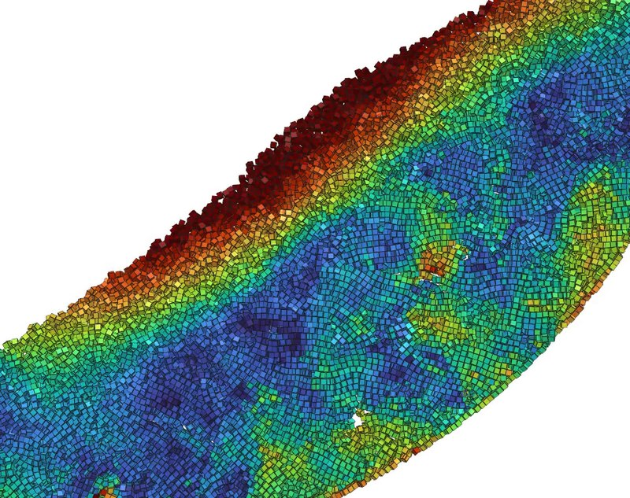

::::::

[**`peclet`**](https://pypi.org/project/peclet/) is an open-source simulation suite for
**incompressible CFD** (cut-cell immersed boundaries over signed-distance geometry), **discrete
element granular dynamics** (spheres and arbitrary SDF shapes), and **coupled gas–solid CFD-DEM**
— driven entirely from Python, running on one code base from a laptop CPU to multi-GPU clusters
(Kokkos: CUDA, HIP, OpenMP; MPI for multi-rank).

```bash
pip install peclet          # CPU wheels — every page here runs from this
pip install peclet-flow-cu13 peclet-dem-cu13   # CUDA wheels for the GPU sections
```

**Why peclet?**

:::::: {.pitch}
- **One stack, three physics.** A validated Navier–Stokes solver, an XPBD discrete-element solver,
  and the volume-averaged coupling between them — the same SDF geometry and the same Python arrays
  end to end.
- **Python-first, zero-copy.** Fields and particle states are NumPy/CuPy views into solver memory —
  no file shuffling, no lock-in, `matplotlib`/`PyVista` straight from the GPU.
- **Runs where you are.** The identical script runs on a free Colab CPU, a workstation GPU, or an
  MPI cluster. Every example carries an *Open in Colab* badge.
- **Evidence, not claims.** Every figure on this site is produced by executing the page against the
  released package — analytical solutions, published benchmarks (Ghia, Schäfer–Turek, Zick–Homsy,
  MFIX-Exa, X-ray tomography beds), and textbook checks throughout.
- **Honest scale.** A million-particle fluidized bed — deposition, drag, projection, collisions —
  advances in seconds per step on a single GPU.

::::::

---

## Single-phase flow

:::::: {.section-lead}
The `flow` solver: exact and canonical benchmarks for the cut-cell immersed-boundary
Navier–Stokes core — from machine-precision channel flow to buoyant convection and a turbulent
channel DNS.

::::::

:::::: {.grid}

::::: {.g-col-12 .g-col-sm-6 .g-col-lg-4}
:::: {.gallery-card}
[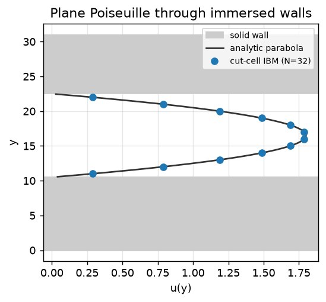](examples/poiseuille-ibm/index.qmd)

::: {.card-body}
#### [Plane Poiseuille — cut-cell IBM is exact](examples/poiseuille-ibm/index.qmd)
Channel flow past immersed no-slip walls, reproduced to machine precision — and the validation
trap that makes it *look* inexact.
[flow · IBM · verification]{.tags}

:::
::::
:::::

::::: {.g-col-12 .g-col-sm-6 .g-col-lg-4}
:::: {.gallery-card}
[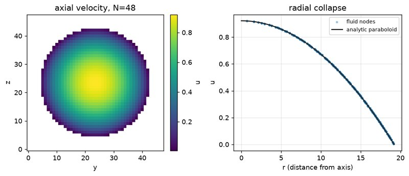](examples/pipe-poiseuille/index.qmd)

::: {.card-body}
#### [Pipe flow — second-order convergence](examples/pipe-poiseuille/index.qmd)
The same parabolic flow through a *curved* wall, where the cut cells show their genuine O(h²)
accuracy.
[flow · IBM · convergence]{.tags}

:::
::::
:::::

::::: {.g-col-12 .g-col-sm-6 .g-col-lg-4}
:::: {.gallery-card}
[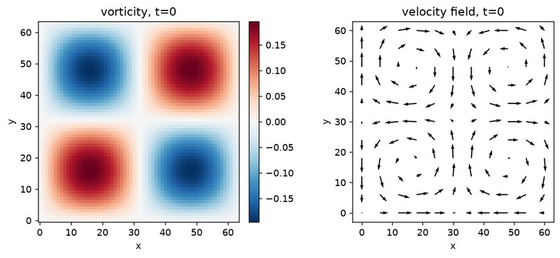](examples/taylor-green/index.qmd)

::: {.card-body}
#### [Taylor–Green vortex](examples/taylor-green/index.qmd)
An exact unsteady Navier–Stokes solution: divergence projected to ~10⁻¹⁵, kinetic energy decaying
at the analytic rate.
[flow · projection · verification]{.tags}

:::
::::
:::::

::::: {.g-col-12 .g-col-sm-6 .g-col-lg-4}
:::: {.gallery-card}
[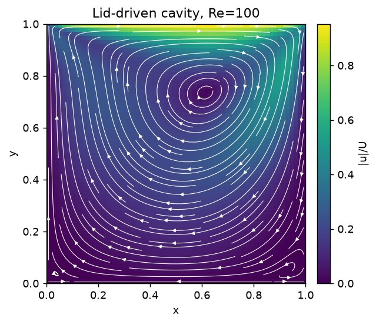](examples/lid-driven-cavity/index.qmd)

::: {.card-body}
#### [Lid-driven cavity](examples/lid-driven-cavity/index.qmd)
The classic recirculating benchmark against the Ghia–Ghia–Shin tables, up to Re 1000.
[flow · benchmark]{.tags}

:::
::::
:::::

::::: {.g-col-12 .g-col-sm-6 .g-col-lg-4}
:::: {.gallery-card}
[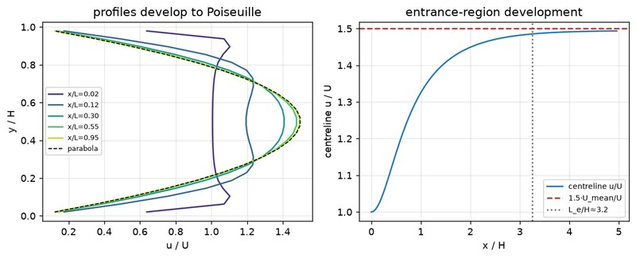](examples/developing-channel/index.qmd)

::: {.card-body}
#### [Developing channel flow](examples/developing-channel/index.qmd)
A uniform stream relaxes into the parabolic profile — the entrance region with inflow/outflow
boundaries.
[flow · boundary conditions]{.tags}

:::
::::
:::::

::::: {.g-col-12 .g-col-sm-6 .g-col-lg-4}
:::: {.gallery-card}
[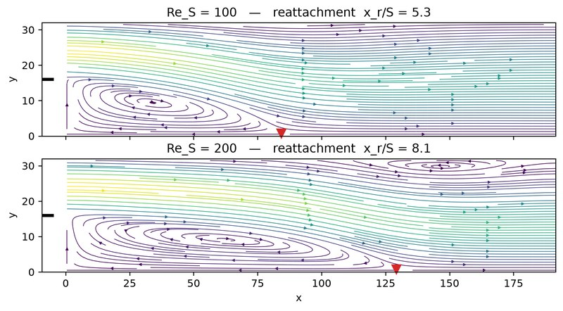](examples/backward-facing-step/index.qmd)

::: {.card-body}
#### [Backward-facing step](examples/backward-facing-step/index.qmd)
Separation and reattachment: the canonical separated-flow benchmark, reattachment length tracked
vs Reynolds number.
[flow · separation · benchmark]{.tags}

:::
::::
:::::

::::: {.g-col-12 .g-col-sm-6 .g-col-lg-4}
:::: {.gallery-card}
[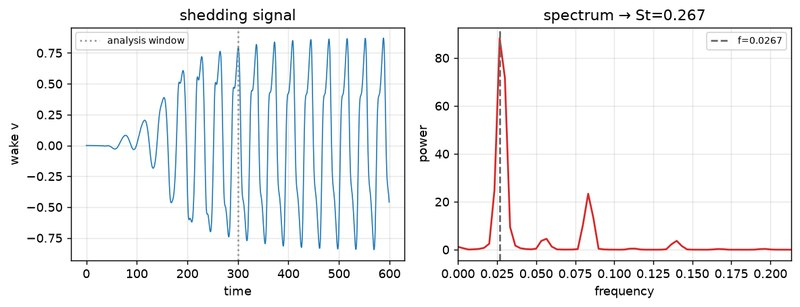](examples/cylinder-vortex-street/index.qmd)

::: {.card-body}
#### [Cylinder vortex street](examples/cylinder-vortex-street/index.qmd)
Kármán shedding past an immersed cylinder, drag/lift and Strouhal number vs the Schäfer–Turek
benchmark.
[flow · IBM · benchmark]{.tags}

:::
::::
:::::

::::: {.g-col-12 .g-col-sm-6 .g-col-lg-4}
:::: {.gallery-card}
[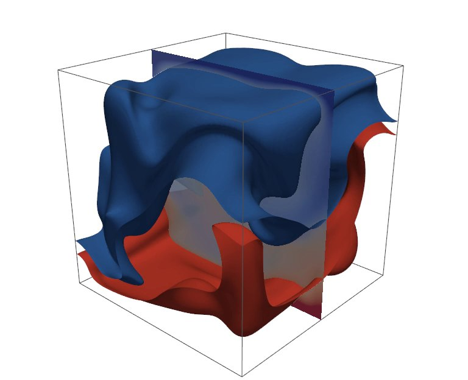](examples/rayleigh-benard/index.qmd)

::: {.card-body}
#### [Rayleigh–Bénard convection](examples/rayleigh-benard/index.qmd)
3-D Boussinesq convection on the GPU: critical Rayleigh number to 0.4%, Nusselt numbers matching
published DNS.
[flow · heat transfer · GPU]{.tags}

:::
::::
:::::

::::: {.g-col-12 .g-col-sm-6 .g-col-lg-4}
:::: {.gallery-card}
[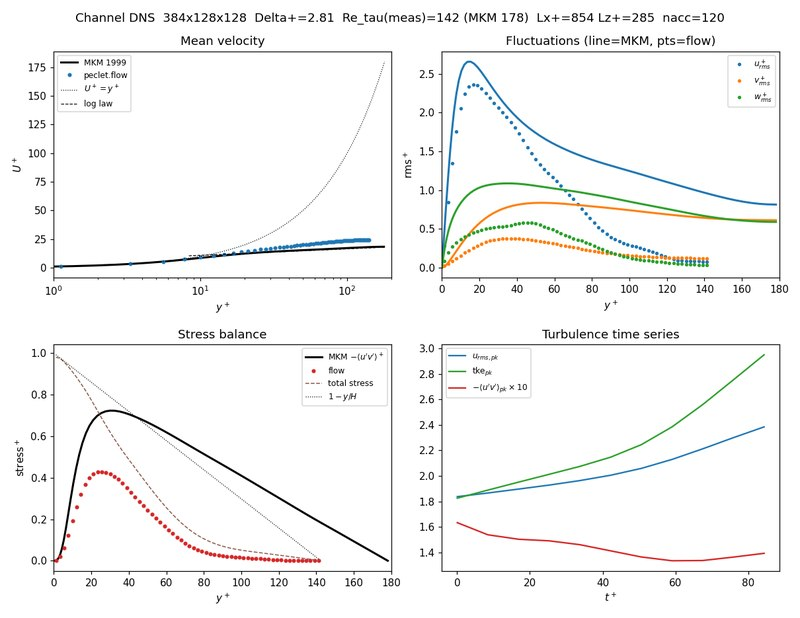](examples/wall-bounded-turbulence/index.qmd)

::: {.card-body}
#### [Wall-bounded turbulence](examples/wall-bounded-turbulence/index.qmd)
A channel DNS against the Moser–Kim–Mansour data, with the HPC submit scripts to reproduce it.
[flow · DNS · MPI/HPC]{.tags}

:::
::::
:::::

::::::

## Flow through packings & porous media

:::::: {.section-lead}
Where `dem` meets `flow`: build a packing with the particle solver, hand the geometry to the fluid
solver as a signed-distance field, and measure drag and permeability against the literature.

::::::

:::::: {.grid}

::::: {.g-col-12 .g-col-sm-6 .g-col-lg-4}
:::: {.gallery-card}
[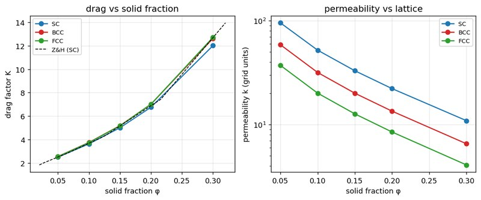](examples/zick-homsy/index.qmd)

::: {.card-body}
#### [Zick–Homsy sphere arrays](examples/zick-homsy/index.qmd)
Stokes drag through ordered sphere lattices to <0.5% of the exact series solutions, across the
full solid-fraction range.
[flow · IBM · verification]{.tags}

:::
::::
:::::

::::: {.g-col-12 .g-col-sm-6 .g-col-lg-4}
:::: {.gallery-card}
[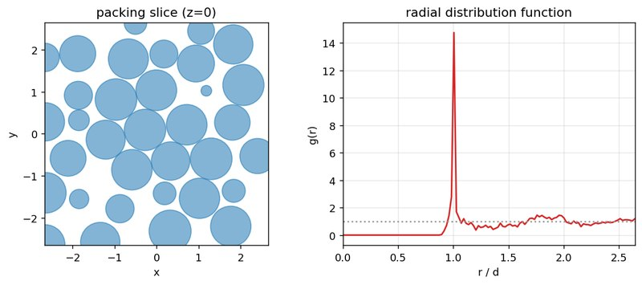](examples/random-packed-bed/index.qmd)

::: {.card-body}
#### [Random packed bed](examples/random-packed-bed/index.qmd)
Pour a packing with `dem`, solve the flow through it, recover Kozeny–Carman/Ergun permeability.
[dem → flow · permeability]{.tags}

:::
::::
:::::

::::: {.g-col-12 .g-col-sm-6 .g-col-lg-4}
:::: {.gallery-card}
[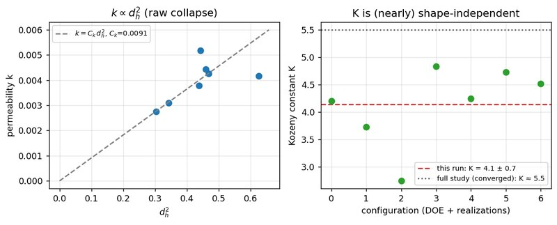](examples/ring-packed-bed/index.qmd)

::: {.card-body}
#### [Ring packed-bed permeability](examples/ring-packed-bed/index.qmd)
A parametric ΔP study over beds of Raschig rings — non-spherical packing to pressure drop in one
pipeline.
[dem → flow · non-spherical]{.tags}

:::
::::
:::::

::::: {.g-col-12 .g-col-sm-6 .g-col-lg-4}
:::: {.gallery-card}
[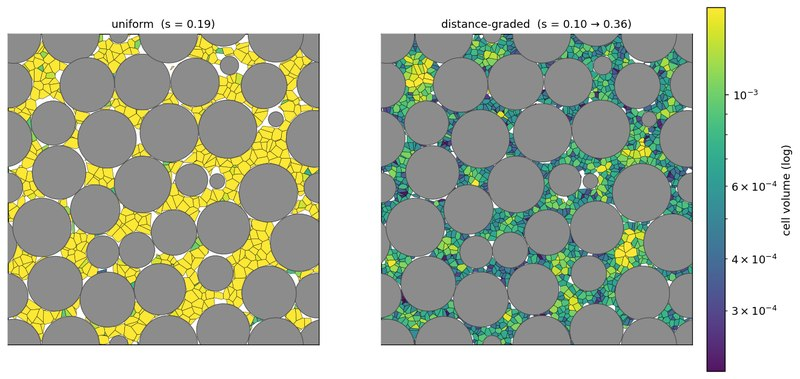](examples/pore-mesh-voronoi/index.qmd)

::: {.card-body}
#### [Pore-space Voronoi mesh](examples/pore-mesh-voronoi/index.qmd)
Tessellate the void space of a packing into a graded polyhedral mesh with the `voro` engine.
[dem → voro · meshing]{.tags}

:::
::::
:::::

::::::

## Granular dynamics

:::::: {.section-lead}
The `dem` solver on its own: dense packings of spheres and arbitrary SDF shapes, moving container
geometry, and hundred-thousand-particle scale on one GPU.

::::::

:::::: {.grid}

::::: {.g-col-12 .g-col-sm-6 .g-col-lg-4}
:::: {.gallery-card}
[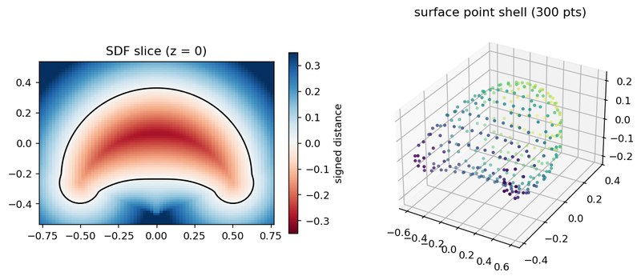](examples/sdf-particle-packing/index.qmd)

::: {.card-body}
#### [Custom-shaped particles](examples/sdf-particle-packing/index.qmd)
Pack arbitrary shapes — capsules, stars, imported meshes — via signed-distance collision.
[dem · SDF shapes]{.tags}

:::
::::
:::::

::::: {.g-col-12 .g-col-sm-6 .g-col-lg-4}
:::: {.gallery-card}
[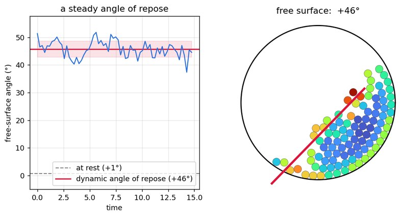](examples/rotating-drum/index.qmd)

::: {.card-body}
#### [Rotating drum](examples/rotating-drum/index.qmd)
A moving SDF wall drives continuous avalanching at a steady dynamic angle of repose.
[dem · moving walls]{.tags}

:::
::::
:::::

::::: {.g-col-12 .g-col-sm-6 .g-col-lg-4}
:::: {.gallery-card}
[](examples/tumbling-cubes/index.qmd)

::: {.card-body}
#### [Tumbling cubes](examples/tumbling-cubes/index.qmd)
100,000 sharp-edged cubes cascading in a drum at ~10 ms per step on one GPU — with the movie.
[dem · non-spherical · GPU]{.tags}

:::
::::
:::::

::::::

## Gas–solid CFD-DEM

:::::: {.section-lead}
The `coupling` module runs both solvers together — volume-averaged gas, per-particle drag,
momentum-conserving feedback — and reproduces published gas–solid benchmarks one-to-one.

::::::

:::::: {.grid}

::::: {.g-col-12 .g-col-sm-6 .g-col-lg-4}
:::: {.gallery-card}
[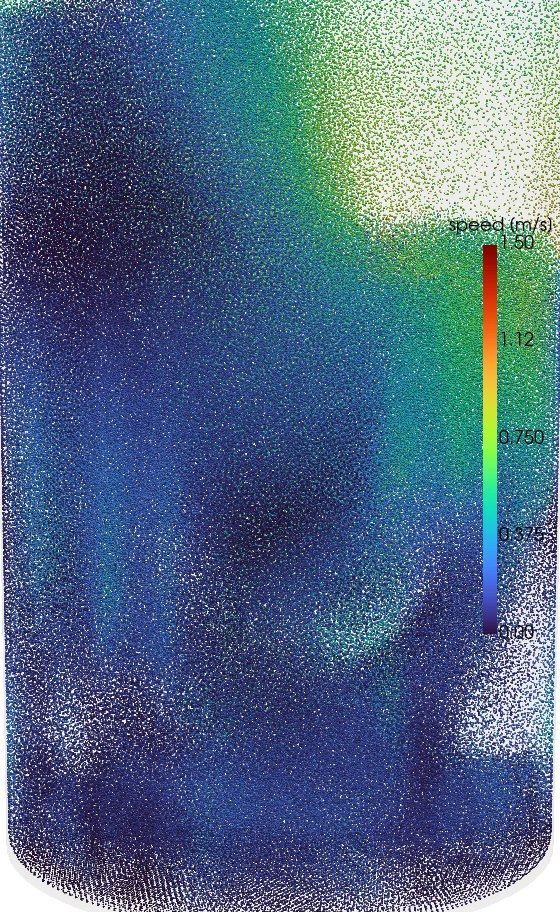](examples/fluidized-bed/index.qmd)

::: {.card-body}
#### [Fluidized bed at engineering scale](examples/fluidized-bed/index.qmd)
One million 1 mm glass beads in air: the bed unpacks, bubbles, and carries its weight in the
pressure drop — live CFD-DEM on one GPU.
[coupling · 10⁶ particles · GPU]{.tags}

:::
::::
:::::

::::: {.g-col-12 .g-col-sm-6 .g-col-lg-4}
:::: {.gallery-card}
[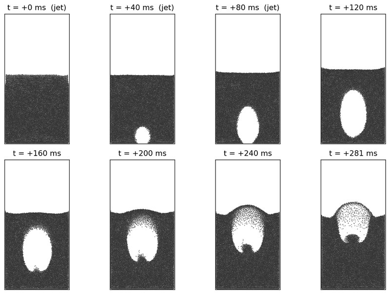](examples/single-bubble-injection/index.qmd)

::: {.card-body}
#### [Single-bubble injection](examples/single-bubble-injection/index.qmd)
An injected bubble rises through an incipient bed — shape and rise velocity against MRI
measurements and MFIX-Exa.
[coupling · validation]{.tags}

:::
::::
:::::

::::: {.g-col-12 .g-col-sm-6 .g-col-lg-4}
:::: {.gallery-card}
[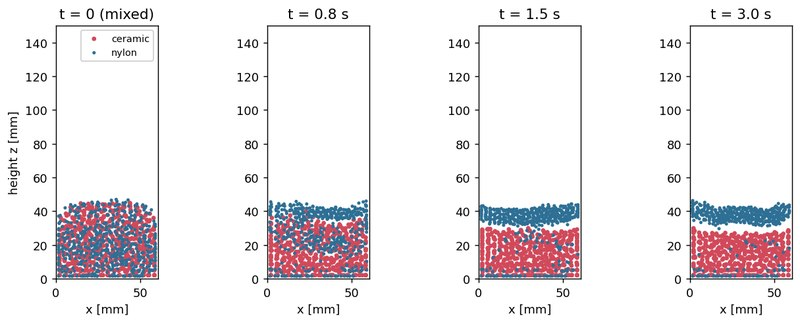](examples/bidisperse-segregation/index.qmd)

::: {.card-body}
#### [Bidisperse segregation](examples/bidisperse-segregation/index.qmd)
Jetsam sinks, flotsam floats: species segregation in a bubbling bed, following the MFIX-Exa
configuration.
[coupling · segregation]{.tags}

:::
::::
:::::

::::: {.g-col-12 .g-col-sm-6 .g-col-lg-4}
:::: {.gallery-card}
[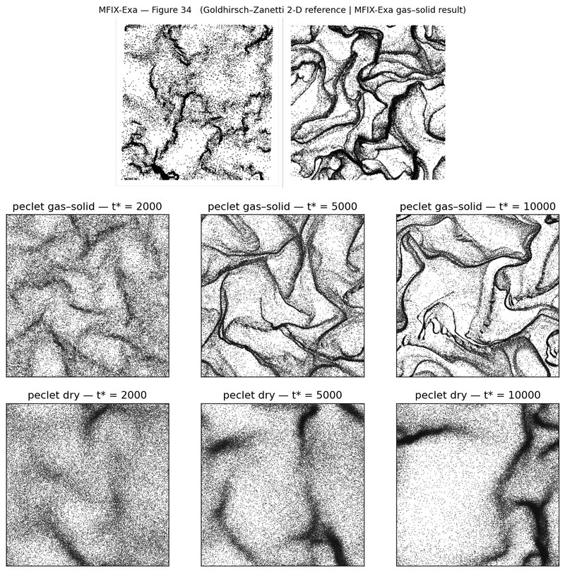](examples/hcs-clustering/index.qmd)

::: {.card-body}
#### [Homogeneous cooling & clustering](examples/hcs-clustering/index.qmd)
Haff's law, the clustering instability, and a one-to-one energy-decay overlay with the MFIX-Exa
benchmark.
[coupling · benchmark]{.tags}

:::
::::
:::::

::::::

---

## Trust, but verify

The examples above *show* what the suite does; two growing collections *prove* it stays correct:

:::::: {.grid}

::::: {.g-col-12 .g-col-md-6}
:::: {.gallery-card}
::: {.card-body}
#### [Sanity checks →](sanity-checks/index.qmd)
Small problems with closed-form answers — restitution, wall bounce, sliding-to-rolling, static
stacks, spin–friction coupling, and a deep layered bed at rest. Each check records a number
against theory in a pass/fail scorecard; together they are the regression tripwire run against
every solver change. New checks are added as new physics lands.
[dem · regression · scorecard]{.tags}

:::
::::
:::::

::::: {.g-col-12 .g-col-md-6}
:::: {.gallery-card}
::: {.card-body}
#### [Benchmarks →](benchmarks/index.qmd)
Quantitative characterization where there is a trade-off to measure, not just a pass to record —
discretization variants, convergence orders, accuracy-versus-cost. Start with
[staggered vs collocated](benchmarks/staggered-vs-collocated/index.qmd) Stokes-drag convergence.
This collection grows as design decisions get measured.
[flow · convergence · characterization]{.tags}

:::
::::
:::::

::::::

## Run any of this yourself

Every page is a self-contained notebook: it builds its geometry and sets every parameter inline.
Click the *Open in Colab* badge on any example to run it on a free CPU runtime, or:

```bash
pip install peclet && git clone https://github.com/computational-chemical-engineering/peclet-examples
quarto render peclet-examples/examples/taylor-green/index.qmd --execute
```

The GPU sections (million-particle beds, cube drums, DNS) need the CUDA wheels or a local build —
each page's *Reproduce this* section gives the exact commands.

:::::: {.callout-note}
## How these pages build
Solver-backed outputs are executed by the authors and **frozen** into the repository, so the site
always builds without a GPU — and what you read is exactly what the released code produced.

::::::
